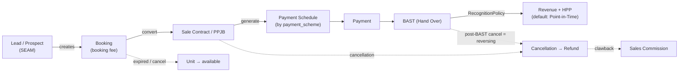
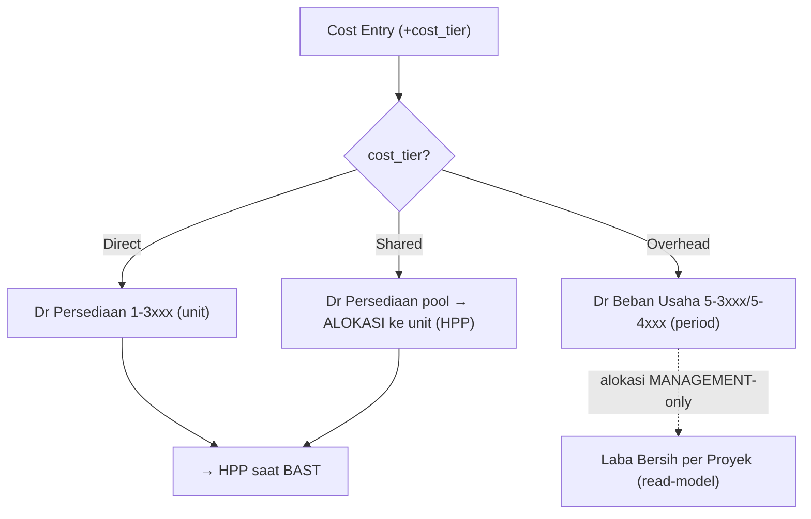
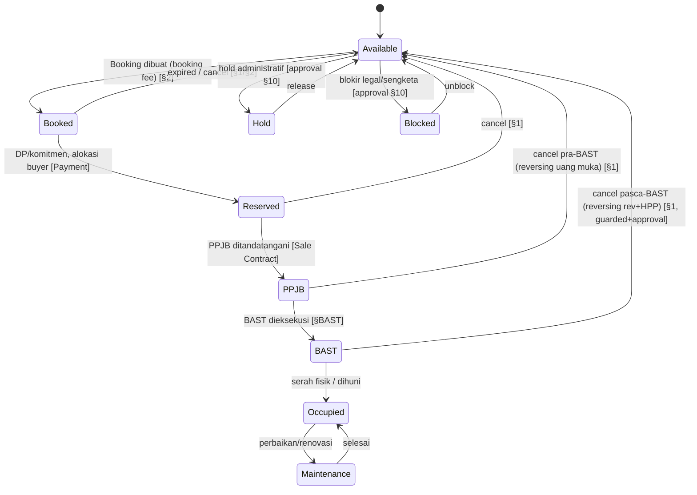
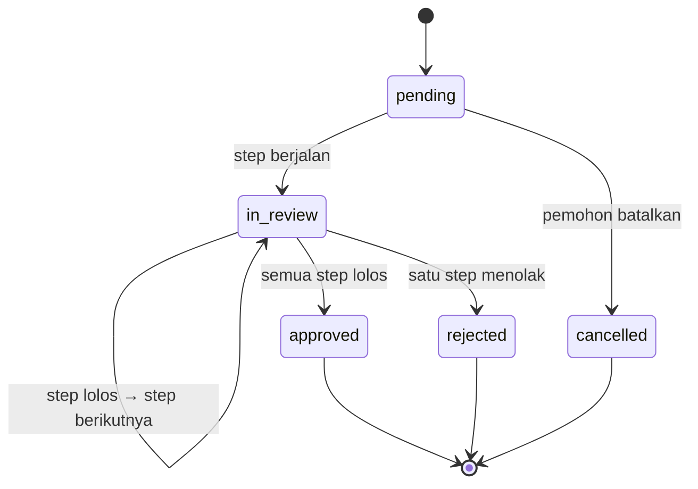
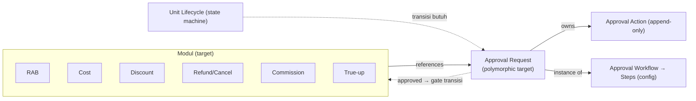

# esaProperti — Blueprint Domain Additions (LOCKED sebelum implementasi)

> Delapan domain dikunci atas permintaan (approval blueprint ~95%). **Domain saja —
> tanpa coding/migration/API.** Melengkapi `erp-blueprint-review.md`,
> `business-architecture.md` v3, `cfo-dashboard-review.md`.
> Prinsip tetap: **ledger-centric** (semua saldo derived), **Project aggregate root**,
> setiap entity **tepat satu owner**, relasi berlabel (owns/references/posts to
> ledger/reads from/creates/snapshots).

Horizon: **CORE** (bangun di program berjalan) · **SEAM** (dimodelkan sekarang,
bangun kemudian, dijamin additive) · **READ-MODEL** (turunan, bukan tabel saldo).

---

## 1. Refund / Cancellation — **CORE**

**Tujuan:** menangani pembatalan pembelian & pengembalian dana secara benar
(state + akuntansi), agar AR, pendapatan, dan stok unit tidak salah.

**Entity baru:**
- **Cancellation** — membatalkan Booking atau Sale Contract; mencatat alasan,
  tanggal, penalti/forfeit.
- **Refund** — pengembalian dana ke buyer (setelah dikurangi penalti).
- **Refund Payable** *(derived)* — saldo kewajiban refund (akun 2-xxxx).

**Owner:** Project (via Contract/Unit) · **references** Buyer, Sales Person.

**Lifecycle (state machine):**
```
requested → approved → processed(refund paid) 
        └→ rejected
```

**Aturan akuntansi (append-only, via reversing — Invariant #5):**
| Kondisi batal | Perlakuan |
|---|---|
| **Pra-BAST** (baru DP/booking) | Lepas Unit → `available`; balikkan Uang Muka; refund = Σ diterima − penalti; penalti = **Pendapatan Lain (forfeit)** |
| **Pasca-BAST** (sudah diakui) | **Reversing** Pendapatan + HPP + PPh Final (jurnal pembalik bertanggal batal, periode berjalan); Unit kembali stok pada nilai aktual; refund via Refund Payable |

**Relasi:** Cancellation **references** Booking/Sale Contract; **creates** Refund;
Refund **posts to ledger**. **Clawback** komisi (§3) dipicu bila sudah dibayar.

**Kenapa CORE:** pembatalan adalah kejadian nyata harian; bila tak dimodelkan,
laba & AR menjadi salah — sulit dikoreksi belakangan.

---

## 2. Booking — entity antara Lead dan Sale Contract — **CORE** (Lead = SEAM/CRM)

**Tujuan:** memesan unit dengan **booking fee** sebelum PPJB; jembatan resmi dari
minat (Lead) ke kontrak (PPJB).

**Entity baru:**
- **Lead / Prospect** *(SEAM/CRM ringan)* — calon pembeli & sumber (funnel).
- **Booking** — pemesanan unit: `booking_fee`, `booking_date`, `expiry_date`, status.
- **Booking Fee** — uang titipan pemesanan (bukan pendapatan): `Dr Bank / Cr Titipan Booking (liability)`.

**Owner:** Project (via Unit) · **references** Buyer/Lead, Sales Person.

**Lifecycle:**
```
active → converted (→ Sale Contract/PPJB; booking fee jadi bagian DP)
      → expired  (lewat expiry → Unit kembali available; fee forfeit/refund)
      → cancelled (fee forfeit atau refund via §1)
```

**Dampak Unit status:** `available → booked(reserved) → sold(BAST)` atau kembali
`available` bila expired/cancel.

**Relasi:** Lead **creates** Booking; Booking **converts to** Sale Contract
(booking fee **references**/ditransfer jadi DP); Booking **posts to ledger** (titipan).

**Funnel (jawab CFO G4/Q14, Q42):** Lead → Booking → PPJB → BAST → collection.

---

## 3. Sales Commission — **SEAM** (Rule → Commission → Approval → Payment → Journal)

**Tujuan:** menghitung & membayar komisi marketing secara terkontrol; jadi beban
perusahaan yang benar.

**Entity baru:**
- **Commission Rule** *(config)* — basis (% nilai jual / tiered / flat per unit),
  `applies_to` (person/team/project/unit_type), `trigger` (at BAST / at collection /
  at lunas), `effective_from/to`, akun `Beban Komisi` & `Utang Komisi`.
- **Commission** — entri komisi per sale/salesperson: amount, status.
- **Commission Payment** — pembayaran komisi ke sales.

**Owner:** Tenant (beban perusahaan) · **references** Sale Record, Sales Person, Project.

**Lifecycle:**
```
calculated → approved → payable → paid
        └→ cancelled / clawback (jika sale dibatalkan §1)
```

**Ledger:** akrual saat trigger `Dr Beban Komisi / Cr Utang Komisi`; bayar
`Dr Utang Komisi / Cr Bank`; **clawback** = reversing bila sale batal.

**Approval:** wajib lewat **Approval Workflow** (§ lihat blueprint review) sebelum payable.

**Kenapa SEAM:** dimodelkan sekarang (reservasi relasi + akun), dibangun setelah core;
additive karena hanya menambah dokumen + posting ke ledger yang sudah backbone.

---

## 4. Marketing Target & KPI — **READ-MODEL**

**Tujuan:** ukur performa marketing (actual vs target) untuk Direktur.

**Entity:**
- **Marketing Target** *(config, stored)* — target per (sales/team/project, periode):
  nilai penjualan, jumlah closing, collection.
- **Marketing KPI** *(read-model, derived)* — actual vs target: closing count, sales
  value, **conversion** (lead→booking→contract), collection rate, achievement %.

**Owner:** Sales Team / Tenant · **reads from** Booking, Sale Contract, BAST, Payment,
atribusi Sales Person.

**Aturan:** KPI **tidak** menyimpan saldo — dihitung dari transaksi + atribusi.
Target adalah konfigurasi periodik. (Menjawab CFO Q7–Q10, Q13.)

---

## 5. Payment Source / Scheme — pada Sale Contract & Payment — **CORE**

**Tujuan:** AR mencerminkan kenyataan pembiayaan (risiko & aging berbeda).

**Model:**
- **Sale Contract.`payment_scheme`** *(configurable list)* — `cash` (tunai keras),
  `kpr` (bank), `inhouse` (cicilan developer), `cash_bertahap`, dst. Menentukan pola
  Payment Schedule + perilaku AR.
- **Payment.`payment_source`** — sumber aktual satu penerimaan (rekening/pencairan
  KPR). *(Sudah ada audit `payment_source`; diperluas ke financing source.)*
- **Financing Source (KPR)** *(SEAM)* — pihak bank pemberi KPR; setelah akad kredit,
  bank mencairkan → **AR berpindah** dari buyer ke bank.

**Dampak AR (penting):**
| Scheme | AR = piutang kepada | Aging/risiko |
|---|---|---|
| Cash | — (lunas di muka) | tak ada |
| KPR | **Bank** (setelah akad) | pendek; risiko bank |
| Inhouse | **Buyer** (jangka panjang) | panjang; risiko buyer |
| Cash bertahap | Buyer (jangka pendek) | menengah |

**Owner:** Contract-level scheme (owns), Payment-level source (**references**).
(Menjawab CFO Q15–Q19 secara realistis.)

---

## 6. Document Management — **SEAM**

**Tujuan:** menyimpan & menautkan dokumen legal/izin/serah-terima ke Project & Unit;
beberapa dokumen **men-gate** transisi lifecycle.

**Entity:**
- **Document** — `doc_type`, `number`, `issued_date`, `expiry`, `status`, `file_ref`,
  tautan ke Project/Unit/Sale Contract/BAST.

**Tipe dokumen (contoh):**
| Kategori | Dokumen | Tertaut ke |
|---|---|---|
| Legal jual | PPJB, AJB | Sale Contract, Unit |
| Sertifikat | SHM / HGB, pecah sertifikat | Unit |
| Izin | PBG/IMB, SLF | Project (kadang Unit) |
| Serah terima | BAST | Unit |
| Pajak | Faktur Pajak, SSP/BPHTB | Sale Contract |

**Owner:** Project (izin) / Unit (SHM, PPJB, AJB, BAST) · **references** Contract.

**Gating (business rule):** mis. BAST butuh PPJB tertandatangani; SHM balik nama
setelah AJB. Document = metadata + pointer file; **tanpa dampak akuntansi** (kecuali
sebagai syarat state).

**Kenapa SEAM:** additive; hanya menambah tabel metadata + relasi, tak menyentuh ledger.

---

## 7. Cost Allocation Policy — **CORE** (bukan sekadar read-model)

**Tegaskan 3 tingkat biaya** agar HPP & laba proyek benar. Setiap **Cost Entry**
wajib berklasifikasi `cost_tier`:

| Tier | Definisi | Kapitalisasi? | Contoh | Perlakuan |
|---|---|---|---|---|
| **Project Cost (Direct)** | jelas milik SATU unit/proyek | ✅ ke Persediaan → HPP | konstruksi unit, tanah kavling | tag `project_id`(+`unit_id`), Dr Persediaan |
| **Shared Cost (Common/Joint)** | dipakai banyak unit/proyek | ✅ ke Persediaan → HPP, **via alokasi** | jalan cluster, gerbang, taman, saluran, tim konstruksi bersama | Dr Persediaan (pool shared) lalu **dialokasikan** ke unit dgn basis (luas/nilai) |
| **Tenant Overhead (G&A / Period)** | biaya perusahaan, bukan produk | ❌ **TIDAK** ke HPP; beban periode (P&L) | gaji kantor pusat, sewa kantor, marketing korporat | Dr Beban Usaha 5-3xxx/5-4xxx |

**Dua peran Cost Allocation Policy (harus dibedakan tegas):**
1. **Shared → Unit (accounting-REAL):** shared/common cost dialokasikan ke unit →
   **masuk HPP**, **posts to ledger** (nyata). Ini perluasan allocation engine (basis
   sama: saleable_area/sales_value). Snapshot HPP wajib mencakup porsi shared.
2. **Overhead → Project (MANAGEMENT-ONLY):** G&A dialokasikan ke proyek **hanya untuk
   laporan laba bersih per proyek** (read-model). **TIDAK** memposting jurnal, **TIDAK**
   mengubah HPP. Basis: pendapatan/nilai/luas.

**Rumus laba (dikunci):**
```
Laba Kotor Proyek   = Pendapatan − HPP(direct + shared)            [dari ledger]
Laba Usaha Proyek   = Laba Kotor − Beban langsung proyek − PPh Final proyek
Laba Bersih Proyek* = Laba Usaha − alokasi G&A (management-only)   [read-model]
(* hanya untuk management reporting; laba resmi perusahaan = agregat ledger)
```

**Kenapa CORE:** salah menaruh overhead ke HPP = laba proyek & harga pokok salah
permanen. `cost_tier` harus ada sejak awal Cost Entry (menghindari refactor besar).
Ini juga menutup CFO G1 (laba bersih per proyek) & G2 (marketing sebagai overhead/period).

---

## 8. Revenue Recognition — **STRATEGY SEAM** (default Point-in-Time)

**Tujuan:** jangan kunci "pendapatan = saat BAST" di kode; buat *policy* agar PSAK 72
over-time bisa masuk tanpa refactor.

**Model:**
- **Project.`revenue_recognition_method`** — `point_in_time` **(DEFAULT)** |
  `percentage_of_completion` *(future)*.
- **BAST tetap event serah-terima** (fisik/legal). **Policy** menentukan **kapan &
  berapa** pendapatan+HPP diakui.

| Method | Pengakuan | Status |
|---|---|---|
| **Point-in-Time** | seluruh Pendapatan+HPP diakui **saat BAST** | **DEFAULT — perilaku sekarang** |
| **Percentage-of-Completion** | diakui **bertahap** mengikuti progress konstruksi (butuh progress measurement + billing termin sebagai kontrak liability) | **FUTURE — seam saja** |

**Seam sekarang:** RecognitionPolicy adalah titik ekstensi tunggal yang dipanggil
di alur pengakuan. Default mengembalikan "akui penuh saat BAST". Tidak ada
implementasi POC sekarang.

**Kenapa penting:** ini **risiko refactor terbesar** (self-review §9). Dengan seam,
perubahan regulasi/akuntansi = tambah strategy, bukan bongkar alur BAST.

---

## Extended Sales Lifecycle (dengan Booking & Cancellation)



## Cost Taxonomy → Ledger



---

## 9. Unit Lifecycle — state machine eksplisit — **CORE**

**Tujuan:** menyatukan status unit yang tersebar (available/reserved/sold) menjadi
**satu state machine tegas** di mana setiap transisi terikat event bisnis & tercatat
(audit). Menjadi dasar business rule seluruh siklus jual.

**Entity:**
- **Unit.`status`** — state tunggal saat ini.
- **Unit Status Transition** *(append-only log)* — `from_status`, `to_status`, `event`,
  `actor`, `at`, `reference` (Booking/Contract/BAST/Cancellation/manual), `note`.
  (Memberi **time-on-market**/stock aging → menjawab CFO Q41.)

**State & transisi (event → domain pemicu):**


**Aturan transisi:**
- Unit **selalu tepat satu status**; hanya transisi di matriks yang sah — transisi
  ilegal ditolak.
- Setiap transisi **wajib mencatat** Unit Status Transition (siapa/kapan/kenapa/ref).
- Transisi tertentu **butuh dokumen** (PPJB butuh dokumen PPJB, §6) atau **approval**
  (Blocked/Hold/cancel pasca-BAST, §10).
- Shortcut cash-keras: `Available → Reserved` (tanpa Booking) diizinkan bila skema
  `cash` (opsional, dikonfig).

**Owner:** **Unit owns** status + transition history · transition **references**
dokumen pemicu (Booking/Contract/BAST/Cancellation).

**Horizon:** **CORE** — status sudah ada; diformalkan jadi state machine + audit log
(additive, tak menyentuh ledger).

---

## 10. Generic Approval Workflow — domain reusable — **CORE (governance)**

**Tujuan:** **satu mekanisme approval** untuk semua modul (RAB, Cost, Discount, Refund,
Cancellation, Commission, True-up, Payment besar, jurnal manual) — **tanpa duplikasi**
tombol approve per modul.

**Entity:**
| Entity | Sifat | Isi |
|---|---|---|
| **Approval Workflow** | config (template) | `target_type` (rab/cost/discount/refund/cancellation/commission/trueup/payment...), nama, aktif, effective |
| **Approval Step** | config | urutan, approver (role/user/dinamis mis. "PM proyek"), **condition/threshold** (mis. nominal ≥ X, kategori, proyek), quorum (all/any/N), eskalasi |
| **Approval Request** | runtime (instance) | **target polimorфik** (`target_type` + `target_id`), `workflow_id`, status, `current_step`, `requested_by`, waktu |
| **Approval Action** | runtime, **append-only** | `request_id`, `step_id`, actor, decision (approve/reject/delegate), komentar, `at` |

> **Approval Matrix** = kombinasi Role/Permission + `condition/threshold` di Approval
> Step (siapa boleh approve apa, sampai nominal berapa).

**Lifecycle Approval Request:**


**Reusability (kunci):** modul melampirkan **Approval Request** via target polimorfik;
**state transition domain digate oleh hasil approval** — bukan logika approve terpisah.

| Modul | Yang di-approve | Efek saat `approved` |
|---|---|---|
| RAB | BudgetPlan | draft → **active** |
| True-up | hpp_trueup_run | calculated → **approved** (baru boleh posting) |
| Refund / Cancellation | Cancellation | boleh proses refund |
| Commission | Commission | payable → boleh dibayar |
| Discount | Sale Contract (diskon > ambang) | harga disetujui |
| Cost / Payment besar | Cost Entry / Payment | boleh posting |

**Migrasi approval existing:** approve RAB & True-up yang kini berupa status langsung
**menjadi konsumen** Approval Request (status domain di-*set* saat request approved).
Menghapus duplikasi, menjaga satu audit trail.

**Ledger:** **tidak ada** (governance/metadata) — tetapi **mem-gate** posting
(True-up/Commission/Cost tak boleh posting sebelum approved).

**Owner:** Approval Workflow/Step **owned by Tenant** (config governance) · Approval
Request **references** target + Workflow, **owns** Approval Action · dokumen target
**references** Approval Request (has-one saat disubmit).

**Horizon:** **CORE (governance)** — model dikunci sekarang; engine generik sebagai
seam yang langsung dipakai RAB & True-up; Approval Matrix threshold menyusul (P2).

---

## 11. Party Master refinements (Customer & Sales Person) — catatan blueprint

Ditambahkan setelah review Increment 1. Domain saja.

- **Code immutable** — `customers.code` & `sales_persons.code` **tidak boleh diubah**
  setelah dibuat (identitas master). Ditegakkan di service (tak ada jalur update).
- **Status lifecycle (ROADMAP)** — `is_active` boolean akan berkembang menjadi
  **status enum** (`active | inactive | resigned | suspended`) saat lifecycle SDM
  (sales resign) & customer (blacklist) dibutuhkan. Additive: tambah `status`,
  backfill dari `is_active`, deprecate boolean. Belum diubah sekarang.
- **Customer segment (dimensi reporting)** — `customers.segment`
  (`subsidi | komersial | investor | corporate`), **berbeda** dari `type`
  (individual/company). Reserved seam; dipakai untuk segmentasi laporan Direktur.
  Catatan: `Project.tax_category` (subsidi/komersial) tetap **penentu pajak** (§7 review);
  `customer.segment` murni dimensi analитик — jangan campur keduanya.
- **Customer Merge / Duplicate Detection (FUTURE)** — kemampuan mendeteksi &
  menggabungkan customer duplikat (mis. NIK/NPWP/nama+telepon sama):
  - **Deteksi**: aturan pencocokan (exact NIK/NPWP, fuzzy nama+HP) → daftar kandidat.
  - **Merge**: pilih *survivor*, arahkan ulang seluruh referensi (`sale_contracts.
    customer_id`, credits, dll.) ke survivor, arsipkan yang kalah (audit, tak dihapus).
  - **Immutability**: merge = event ber-audit (siapa/kapan/kandidat), **tanpa**
    menyentuh ledger; hanya memindahkan pointer referensi. Idealnya lewat Approval
    Workflow (§10) karena berdampak lintas-dokumen.
  Belum diimplementasi — placeholder domain agar future tidak butuh refactor.
- **Contract linkage policy** — Sale Contract **baru wajib** `customer_id` +
  `sales_person_id`; `buyer_ref/buyer_name/buyer_id` legacy backward-compat saja
  (enforcement saat alur kontrak di-rewire).

---

## Cross-cutting layers



---

## Ringkasan horizon (update)
| Domain | Horizon | Catatan |
|---|---|---|
| Refund / Cancellation | **CORE** | naik dari P2 |
| Booking (+ Lead) | **CORE** (Lead SEAM) | jembatan Lead→PPJB |
| Sales Commission | **SEAM** | Rule→Commission→Approval→Payment→Journal (+clawback) |
| Marketing Target & KPI | **READ-MODEL** | actual vs target; derived |
| Payment Source / Scheme | **CORE** | AR realistis (cash/kpr/inhouse/bertahap) |
| Document Management | **SEAM** | PPJB/AJB/SHM/PBG-IMB/BAST/sertifikat; gating |
| Cost Allocation (3-tier) | **CORE** | Direct/Shared (kapitalisasi) vs Overhead (period); + management allocation |
| Revenue Recognition | **STRATEGY SEAM** | PIT default, POC future |
| **Unit Lifecycle** | **CORE** | state machine eksplisit + transition log (audit); event-driven |
| **Generic Approval Workflow** | **CORE (governance)** | Workflow→Step (config) + Request→Action (runtime); reusable semua modul, gate posting |

**Semua tambahan bersifat additive** — tidak mengubah **ledger backbone** maupun
**Project aggregate root**. Blueprint domain kini dianggap **lengkap** untuk memulai
implementasi tanpa risiko refactor besar.
