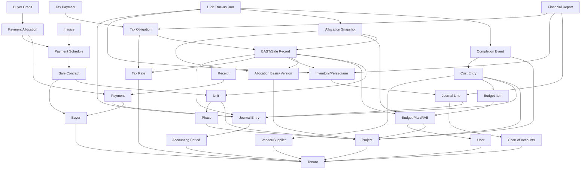

# esaProperti — Domain Model (Business-Level) — **v2**

> Fokus: memahami bisnis end-to-end + **dependency antar entity**. Bukan DB/kode.
> Setiap entity utama dimodelkan **terpisah** (tidak digabung). Untuk tiap entity:
> **(1) Tujuan bisnis · (2) Owner · (3) Lifecycle · (4) Dependents (yang bergantung
> PADANYA) · (5) Dependencies (yang IA bergantung kepadanya).**

**Arah dependency:** "A → B" berarti **A membutuhkan B lebih dulu** (A depends on B).
Entity di layer atas membutuhkan entity layer bawah.

### Aktor / peran (kolom Owner)
OWN=Owner/Direktur · PM=Project Manager · CC=Cost Controller · SLS=Sales ·
FIN=Accounting/Finance · TAX=Staff Pajak · BUY=Buyer (eksternal) · AUD=Auditor ·
SYS=Sistem (otomatis).

### Beda entity yang WAJIB dipisah (prinsip)
- **COA ≠ Journal Entry ≠ Journal Line** (daftar akun ≠ transaksi ≠ baris debit/kredit).
- **Inventory ≠ Cost Entry** (saldo persediaan ≠ dokumen biaya).
- **Invoice ≠ Payment ≠ Receipt** (tagihan ≠ uang diterima ≠ bukti terima).
- **Budget Plan ≠ Budget Item** (dokumen RAB ≠ baris anggaran).
- **Tax Rate ≠ Tax Obligation ≠ Tax Payment** (tarif ≠ utang pajak ≠ pelunasan).

---

# LAYER 0 — Fondasi (tak bergantung entity bisnis lain)

## 1. Tenant
1. **Tujuan:** batas organisasi & isolasi data satu perusahaan developer.
2. **Owner:** OWN.
3. **Lifecycle:** dibuat saat registrasi → aktif → (nonaktif; tak dihapus).
4. **Dependents:** SEMUA entity lain (semua ber-`tenant`).
5. **Dependencies:** — (root).

## 2. User
1. **Tujuan:** identitas + peran yang menjadi **aktor** setiap event bisnis (audit "siapa").
2. **Owner:** OWN.
3. **Lifecycle:** diundang/dibuat → aktif → nonaktif.
4. **Dependents:** semua event yang mencatat actor (RAB approve, BAST, True-up, dll).
5. **Dependencies:** Tenant.

## 3. Accounting Period
1. **Tujuan:** kontrol periode **open/closed**; menjaga transaksi jatuh di periode benar & mencegah edit periode tertutup.
2. **Owner:** FIN.
3. **Lifecycle:** dibuka (open) → ditutup (closed) → (reopen hanya kebijakan khusus — di esaProperti: tidak, True-up pakai periode berjalan/D4).
4. **Dependents:** Journal Entry (di-gate olehnya).
5. **Dependencies:** Tenant.

## 4. Chart of Accounts (COA / Account)
1. **Tujuan:** **kerangka akun** (kas, bank, piutang, persediaan 1-3xxx, uang muka, pendapatan, HPP 5-1000, beban, pajak). Menentukan klasifikasi setiap angka.
2. **Owner:** FIN.
3. **Lifecycle:** dibuat (seed saat registrasi) → aktif → nonaktif (tak dihapus bila terpakai).
4. **Dependents:** Journal Line (merujuk akun), semua posting, Report.
5. **Dependencies:** Tenant.

## 5. Tax Rate (Tarif Pajak)
1. **Tujuan:** master tarif berlaku (PPN, PPh Final penjualan properti).
2. **Owner:** TAX/FIN.
3. **Lifecycle:** ditetapkan → berlaku (periode) → digantikan versi baru (histori).
4. **Dependents:** BAST (hitung PPN/PPh), Tax Obligation.
5. **Dependencies:** Tenant.

---

# LAYER 1 — Master Produk & Pihak

## 6. Project (Proyek)
1. **Tujuan:** wadah pengembangan; tempat biaya diakumulasi & unit dijual.
2. **Owner:** PM.
3. **Lifecycle:** planning → active → selling → **completed** (via Completion Event).
4. **Dependents:** Phase, Unit, Budget Plan, Cost Entry, Allocation Basis, Completion Event, True-up.
5. **Dependencies:** Tenant.

## 7. Phase (Fase)
1. **Tujuan:** subdivisi proyek untuk pengelolaan/pelaporan bertahap; bisa jadi **scope** RAB & True-up.
2. **Owner:** PM.
3. **Lifecycle:** planning → active → completed.
4. **Dependents:** Unit (opsional), Budget Plan (opsional per fase), Completion Event/True-up (opsional per fase).
5. **Dependencies:** Project, Tenant.

## 8. Unit
1. **Tujuan:** **produk yang dijual** (rumah/kavling/ruko); pembawa atribut **basis alokasi** (luas/harga) dan **penerima HPP**.
2. **Owner:** PM (master), SLS (status jual).
3. **Lifecycle:** available → reserved → **sold** (saat BAST). Pasca-completion tetap bisa terjual (HPP finalized).
4. **Dependents:** Sale Contract, Payment, BAST, Allocation Snapshot, True-up Line, Invoice, Tax Obligation.
5. **Dependencies:** Project, Phase (opsional), Tenant.

## 9. Buyer (Pembeli)
1. **Tujuan:** **pihak pembeli** unit (identitas, kontak, NPWP). *(Saat ini masih `buyer_ref`/nama — Gap #1: belum master penuh.)*
2. **Owner:** SLS.
3. **Lifecycle:** prospek → pembeli aktif → (arsip; tak dihapus).
4. **Dependents:** Sale Contract, Payment, BAST, Invoice, Receipt.
5. **Dependencies:** Tenant.

## 10. Vendor / Supplier
1. **Tujuan:** **pihak pemasok/kontraktor** sumber biaya pengembangan (tanah, konstruksi, jasa). *(Gap #2: belum dimodelkan sebagai master; kandidat entity.)*
2. **Owner:** CC/FIN.
3. **Lifecycle:** didaftarkan → aktif → nonaktif.
4. **Dependents:** Cost Entry (asal biaya), Hutang (jika termin).
5. **Dependencies:** Tenant.

---

# LAYER 2 — Perencanaan Biaya

## 11. Budget Plan / RAB
1. **Tujuan:** **dokumen** rencana anggaran biaya yang **disetujui**; baseline HPP (Budgeted Cost Allocation) & gate sebelum jualan. Ber-versi (1 aktif per proyek/fase, Inv #8).
2. **Owner:** CC (menyusun), OWN (menyetujui).
3. **Lifecycle:** draft → **active** (approved) → superseded (saat versi baru approve). Setelah active: **immutable**.
4. **Dependents:** Budget Item, Allocation Snapshot (pin RAB version), True-up (baseline).
5. **Dependencies:** Project (+Phase opsional), User approver, Tenant.

## 12. Budget Item (Baris RAB)
1. **Tujuan:** **rincian** anggaran per kategori (tanah/konstruksi/soft/financing/marketing/other).
2. **Owner:** CC.
3. **Lifecycle:** dibuat/diedit **hanya saat plan draft** → beku saat plan active.
4. **Dependents:** Cost Entry (tautan opsional RAB-vs-realisasi), HPP pool.
5. **Dependencies:** **Budget Plan** (tak bisa berdiri sendiri), Tenant.

## 13. Allocation Basis / Config (+ Version)
1. **Tujuan:** aturan **cara membagi** biaya proyek ke unit (`saleable_area`/`sales_value`). **Immutable setelah snapshot pertama** (D1); ubah = versi baru.
2. **Owner:** CC/FIN.
3. **Lifecycle:** diset → aktif → (versi baru menggantikan; versi lama disimpan untuk audit).
4. **Dependents:** Allocation Snapshot (pin version), True-up (basis konsisten IMPL-1).
5. **Dependencies:** Project, Tenant.

---

# LAYER 3 — Ledger (Backbone transaksional)

## 14. Journal Entry (Kepala Jurnal)
1. **Tujuan:** **satu transaksi akuntansi** (tanggal, deskripsi, sumber) yang balanced. **Unit of record** finansial.
2. **Owner:** FIN/SYS.
3. **Lifecycle:** created (draft) → **posted** (immutable, Inv #5) → koreksi hanya via **reversing entry** (jurnal baru).
4. **Dependents:** Journal Line, dan semua event yang "menghasilkan jurnal" (Cost, Payment, BAST, True-up, Tax).
5. **Dependencies:** **Accounting Period** (harus open), User, Tenant.

## 15. Journal Line (Baris Jurnal)
1. **Tujuan:** **satu sisi** debit/kredit ke **satu akun** (nominal, unit/proyek tag). Penjumlahannya membentuk keseimbangan (Σdebit=Σkredit).
2. **Owner:** FIN/SYS.
3. **Lifecycle:** dibuat bersama Journal Entry → immutable setelah posted.
4. **Dependents:** — (leaf); dibaca Inventory & Report.
5. **Dependencies:** **Journal Entry** (induk) **+ Account/COA** (klasifikasi). Tak bisa ada tanpa keduanya.

## 16. Inventory / Persediaan Real Estat (saldo, bukan dokumen)
1. **Tujuan:** **akumulasi biaya aktual** proyek (akun 1-3xxx) yang belum menjadi HPP; saldo = biaya unit belum terjual. **Derivasi dari Journal Line**, bukan dokumen.
2. **Owner:** FIN.
3. **Lifecycle:** bertambah (kapitalisasi biaya) → berkurang (HPP saat BAST & True-up) → 0 saat semua unit terjual & trued-up.
4. **Dependents:** BAST (mengonsumsi), True-up (rekonsiliasi), Neraca.
5. **Dependencies:** Journal Line pada akun 1-3xxx (dari Cost Entry/BAST/True-up), COA.

---

# LAYER 4 — Realisasi Biaya

## 17. Cost Entry (Biaya Pengembangan)
1. **Tujuan:** **dokumen** biaya aktual yang terjadi; saat diposting mengkapitalisasi ke Inventory (atau beban untuk marketing/other).
2. **Owner:** CC (input), FIN (posting).
3. **Lifecycle:** draft → **posted** (immutable; koreksi via reversing).
4. **Dependents:** Inventory (mengisi), RAB-vs-Realisasi, True-up (sumber biaya aktual A_c).
5. **Dependencies:** Project, **Journal Entry** (saat posted), Budget Item (opsional), Vendor (opsional), COA, Tenant.

---

# LAYER 5 — Penjualan & Penerimaan

## 18. Sale Contract (Kontrak / PPJB)
1. **Tujuan:** **kesepakatan** menjual unit ke buyer (harga, KPR/tunai).
2. **Owner:** SLS.
3. **Lifecycle:** dibuat → aktif → (batal via status) / berlanjut ke BAST.
4. **Dependents:** Payment Schedule, (menuju) BAST.
5. **Dependencies:** **Unit**, **Buyer**, Tenant.

## 19. Payment Schedule (Jadwal Termin/Cicilan)
1. **Tujuan:** **rencana** pembayaran bertahap (uang muka, cicilan, pelunasan).
2. **Owner:** SLS/FIN.
3. **Lifecycle:** scheduled → due → **paid** (status dihitung backend dari penerimaan).
4. **Dependents:** Payment Allocation (target), Invoice, Buyer Credit (aplikasi).
5. **Dependencies:** **Sale Contract**, Unit, Tenant.

## 20. Payment (Penerimaan / Termin)
1. **Tujuan:** **uang diterima** dari buyer. Pra-BAST → Uang Muka (kewajiban); pasca-BAST → pelunasan Piutang. (≠ Invoice, ≠ Receipt.)
2. **Owner:** FIN.
3. **Lifecycle:** dicatat → **immutable** (koreksi via reversing).
4. **Dependents:** Payment Allocation, Receipt, Buyer Credit, Journal Entry.
5. **Dependencies:** **Buyer/Unit**, akun kas/bank (COA), **Journal Entry**, Tenant.

## 21. Payment Allocation (Sub-ledger)
1. **Tujuan:** memetakan **uang → cicilan** (many-to-many); menjaga rekonsiliasi penerimaan vs tagihan; menandai kelebihan sebagai buyer credit.
2. **Owner:** FIN/SYS.
3. **Lifecycle:** dibuat saat penerimaan → append-only (tak diedit/hapus).
4. **Dependents:** Buyer Credit, status Payment Schedule.
5. **Dependencies:** **Payment** + **Payment Schedule** (menghubungkan keduanya), Tenant.

## 22. Buyer Credit / Credit Application
1. **Tujuan:** **saldo kredit** buyer (overpay) + pemakaiannya ke tagihan lain (reklas sub-ledger, tanpa kas/jurnal baru).
2. **Owner:** FIN.
3. **Lifecycle:** timbul (overpay) → tersedia → diterapkan (habis/berkurang), append-only.
4. **Dependents:** status Payment Schedule (saat diterapkan).
5. **Dependencies:** **Payment/Payment Allocation** (sumber saldo), Payment Schedule (target), Tenant.

---

# LAYER 6 — Penagihan & Bukti (≠ Payment)

## 23. Invoice (Tagihan)
1. **Tujuan:** **menagih** buyer sesuai schedule/termin (dokumen tagihan, belum tentu dibayar).
2. **Owner:** FIN.
3. **Lifecycle:** issued → outstanding → paid/void.
4. **Dependents:** (pelunasan oleh) Payment; laporan AR aging.
5. **Dependencies:** **Payment Schedule/Unit**, Buyer, Tenant.

## 24. Receipt (Kwitansi)
1. **Tujuan:** **bukti terima uang** (idempoten, bernomor). Bukan jurnal, bukan tagihan.
2. **Owner:** FIN/SYS.
3. **Lifecycle:** diterbitkan saat penerimaan → immutable.
4. **Dependents:** — (bukti untuk buyer/audit).
5. **Dependencies:** **Payment**, Buyer, Tenant.

---

# LAYER 7 — Pengakuan Penjualan & HPP

## 25. BAST / Sale Record (Serah Terima)
1. **Tujuan:** **event pengakuan** — saat serah terima unit: akui **Pendapatan** + **HPP** (budgeted), tandai unit `sold`, picu pajak.
2. **Owner:** SLS (memicu), FIN (memposting). *System-of-record = ledger (FIN).*
3. **Lifecycle:** dieksekusi (atomik) → **immutable** (Inv #4/#5).
4. **Dependents:** Allocation Snapshot, Journal Entry (revenue+COGS), Tax Obligation, True-up.
5. **Dependencies:** **Unit**, **Budget Plan** (baseline+freeze), **Allocation Basis**, **Inventory**, Buyer, Tax Rate, Accounting Period, Tenant.

## 26. Allocation Snapshot (Bukti HPP)
1. **Tujuan:** **bekukan bukti HPP** saat BAST — porsi RAB per accounting_class + bukti basis (type/value/%) + identitas unit historis. **Immutable**, terbaca auditor tanpa master.
2. **Owner:** FIN (historical record).
3. **Lifecycle:** dibuat saat BAST → **immutable selamanya** (koreksi hanya via True-up, bukan edit).
4. **Dependents:** True-up (input budgeted), audit.
5. **Dependencies:** **BAST/Sale Record**, **Budget Plan version**, **Allocation Basis version**, Unit, Tenant.

---

# LAYER 8 — Penyelesaian & Rekonsiliasi

## 27. Project Completion Event
1. **Tujuan:** **event akuntansi** menandai konstruksi selesai lalu **mengunci biaya aktual final** (A_c) — gate True-up.
2. **Owner:** PM (mark), FIN (finalize cost).
3. **Lifecycle:** draft → completed → **finalized** (maju saja; finalized tak balik).
4. **Dependents:** HPP True-up Run.
5. **Dependencies:** **Project/Phase**, Cost Entry final (Inventory), Tenant.

## 28. HPP True-up Run
1. **Tujuan:** **closing** — rekonsiliasi HPP **budgeted → aktual** saat proyek selesai; hitung variance, posting jurnal penyesuaian (unit terjual), finalize HPP unit belum terjual (D2).
2. **Owner:** FIN (calculate/post), OWN (approve).
3. **Lifecycle:** draft → calculated → approved → **posted** (immutable) / cancelled.
4. **Dependents:** Journal Entry (penyesuaian), HPP finalized (untuk penjualan pasca-completion), Report.
5. **Dependencies:** **Completion Event**, **Allocation Snapshot** (budgeted), **Inventory** (aktual), Allocation Basis version, Accounting Period, Tenant.

---

# LAYER 9 — Pajak (Penyelesaian)

## 29. Tax Obligation (Kewajiban Pajak)
1. **Tujuan:** **utang pajak** yang diakui (mis. PPh Final saat BAST).
2. **Owner:** TAX/FIN.
3. **Lifecycle:** diakrual (saat BAST) → outstanding → lunas.
4. **Dependents:** Tax Payment, Neraca (liabilitas).
5. **Dependencies:** **BAST**, **Tax Rate**, Journal Entry, Tenant.

## 30. Tax Payment (Pembayaran Pajak)
1. **Tujuan:** **pelunasan** kewajiban pajak ke kas negara.
2. **Owner:** TAX/FIN.
3. **Lifecycle:** dibayar → immutable.
4. **Dependents:** status Tax Obligation.
5. **Dependencies:** **Tax Obligation**, akun kas (COA), Journal Entry, Tenant.

---

# LAYER 10 — Pelaporan (Read-model)

## 31. Financial Report (L/R, Neraca, RAB-vs-Realisasi, AR Aging)
1. **Tujuan:** **turunan** dari ledger + sub-ledger; menyajikan laba, HPP aktual, posisi persediaan, piutang. Bukan entity tersimpan.
2. **Owner:** FIN.
3. **Lifecycle:** dihitung on-demand (read-only).
4. **Dependents:** keputusan OWN.
5. **Dependencies:** Journal Entry/Line (final: BAST+True-up), Payment, Tax, Inventory, Accounting Period.

---

# Peta Dependency (arah: A → B = A butuh B)

---

## Ringkas dependency inti (yang paling menentukan)
- **Semua** butuh **Tenant**.
- **Journal Line** butuh **Journal Entry + COA** — pondasi setiap angka.
- **Journal Entry** butuh **Accounting Period** open.
- **Inventory** murni **turunan Journal Line** (bukan Cost Entry langsung).
- **BAST** butuh **Unit + RAB + Basis + Inventory** (+Tax Rate) — titik temu terbanyak.
- **Allocation Snapshot** butuh **BAST + RAB version + Basis version** — bukti beku.
- **True-up** butuh **Completion + Snapshot + Inventory** — penutup loop biaya.
- **Report** butuh **Journal Line + Inventory + Tax** — hilir dari semua.

## Gap domain (untuk keputusan sebelum ERD)
1. **Buyer** belum master penuh (masih `buyer_ref`). ERP ideal: Customer master.
2. **Vendor/Supplier + Hutang** belum dimodelkan (Cost Entry termin ke kontraktor).
3. **Inventory & Report = derivasi/read-model** (hidup di ledger) — bukan tabel.
4. **BAST owner terbagi** SLS↔FIN; system-of-record = ledger (FIN).
