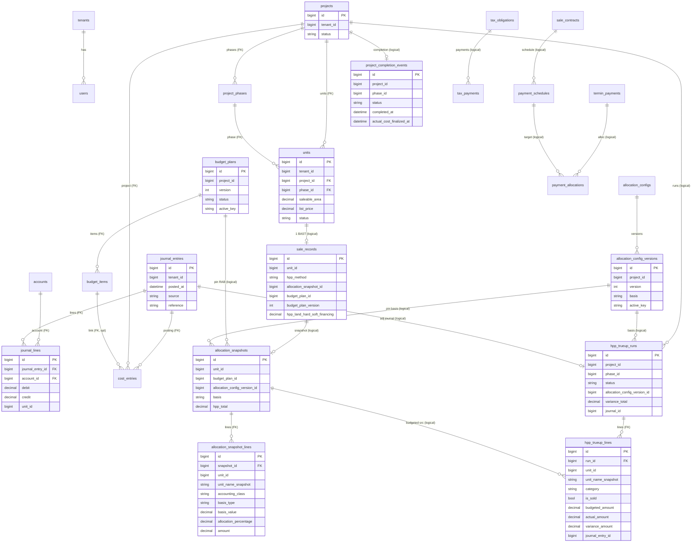

# esaProperti — Database Schema (Flowchart & ERD)

Skema aktual per migrasi `000001`–`000032`. Dua diagram:
- **§1 Flowchart** — semua tabel + relasi, dikelompokkan per domain (Mermaid `flowchart`).
- **§2 ER diagram** — atribut kunci tiap tabel (Mermaid `erDiagram`).

Konvensi:
- **`tenant_id` ada di SETIAP tabel** → isolasi multi-tenant via GORM global scope
  (Invariant #6). Untuk kejelasan, relasi ke `tenants` tidak digambar ke semua tabel.
- **FK** = foreign key fisik (ditegakkan DB). **logical** = relasi tenant-scoped tanpa
  FK fisik (konvensi proyek; dibuktikan integration test).
- Uang `DECIMAL(20,4)` (Inv #2); `journal_*` append-only (Inv #1/#5).
- `schema_migrations` = bookkeeping golang-migrate (tidak digambar).

---

## 1. Flowchart — semua tabel & relasi

```mermaid
flowchart TD
  %% ---------- TENANCY ----------
  subgraph TEN[Tenancy & Auth]
    tenants
    users
  end
  tenants -->|FK| users

  %% ---------- MASTER PROYEK ----------
  subgraph MST[Master Proyek]
    projects
    project_phases
    units
  end
  projects -->|FK| project_phases
  projects -->|FK| units
  project_phases -->|FK| units

  %% ---------- LEDGER INTI ----------
  subgraph LED[Ledger Inti - source of truth]
    accounts
    journal_entries
    journal_lines
    accounting_periods
  end
  accounts -->|FK| journal_lines
  journal_entries -->|FK| journal_lines
  accounting_periods -.->|gate open/closed| journal_entries

  %% ---------- BIAYA: RAB & REALISASI ----------
  subgraph COST[Biaya: RAB & Realisasi]
    budget_plans
    budget_items
    cost_entries
    allocation_configs
    allocation_config_versions
    allocation_executions
  end
  budget_plans -->|FK| budget_items
  projects -->|FK| cost_entries
  journal_entries -->|FK| cost_entries
  budget_items -->|FK opsional| cost_entries
  projects -->|logical| budget_plans
  projects -->|logical| allocation_configs
  allocation_configs -->|logical: versions D1| allocation_config_versions
  projects -->|logical| allocation_executions

  %% ---------- PENJUALAN & HPP ----------
  subgraph SALE[Penjualan, Pembayaran & HPP]
    sale_contracts
    payment_schedules
    termin_payments
    payment_allocations
    credit_applications
    sale_records
    allocation_snapshots
    allocation_snapshot_lines
  end
  units -->|logical| sale_contracts
  sale_contracts -->|logical| payment_schedules
  units -->|logical| termin_payments
  termin_payments -->|logical| payment_allocations
  payment_schedules -->|logical| payment_allocations
  termin_payments -->|logical| credit_applications
  payment_schedules -->|logical| credit_applications
  units -->|logical: 1 BAST/unit| sale_records
  journal_entries -->|logical: revenue+COGS| sale_records
  sale_records -->|logical: snapshot_id| allocation_snapshots
  units -->|logical| allocation_snapshots
  budget_plans -->|logical: pin RAB+version| allocation_snapshots
  allocation_config_versions -->|logical: pin basis| allocation_snapshots
  allocation_snapshots -->|FK| allocation_snapshot_lines

  %% ---------- COMPLETION & TRUE-UP (P0-4) ----------
  subgraph TU[Completion & True-up - P0-4]
    project_completion_events
    hpp_trueup_runs
    hpp_trueup_lines
  end
  projects -->|logical: scope| project_completion_events
  projects -->|logical: scope| hpp_trueup_runs
  allocation_config_versions -->|logical: basis IMPL-1| hpp_trueup_runs
  journal_entries -->|logical: adj journal UNIQUE| hpp_trueup_runs
  hpp_trueup_runs -->|FK| hpp_trueup_lines
  units -->|logical| hpp_trueup_lines
  allocation_snapshots -->|logical: asal budgeted| hpp_trueup_lines
  journal_entries -->|logical: adj line| hpp_trueup_lines

  %% ---------- BILLING & PAJAK ----------
  subgraph BILL[Billing & Pajak]
    invoices
    invoice_sequences
    receipts
    receipt_sequences
    tax_rates
    tax_obligations
    tax_payments
  end
  units -->|logical| invoices
  payment_schedules -->|logical| invoices
  termin_payments -->|logical| receipts
  units -->|logical| tax_obligations
  tax_rates -.->|logical| tax_obligations
  tax_obligations -->|logical| tax_payments
```

---

## 2. ER diagram — atribut kunci

---

## 3. Physical FK (ditegakkan DB) — ringkas

| Child | Kolom | → Parent |
|---|---|---|
| users | tenant_id | tenants |
| project_phases | project_id | projects |
| units | project_id, phase_id | projects, project_phases |
| journal_lines | journal_entry_id, account_id | journal_entries, accounts |
| cost_entries | project_id, journal_entry_id, budget_item_id | projects, journal_entries, budget_items |
| budget_items | budget_plan_id | budget_plans |
| allocation_snapshot_lines | snapshot_id | allocation_snapshots |
| hpp_trueup_lines | run_id | hpp_trueup_runs |

Selebihnya = **logical FK** (lihat label "logical" di diagram).
