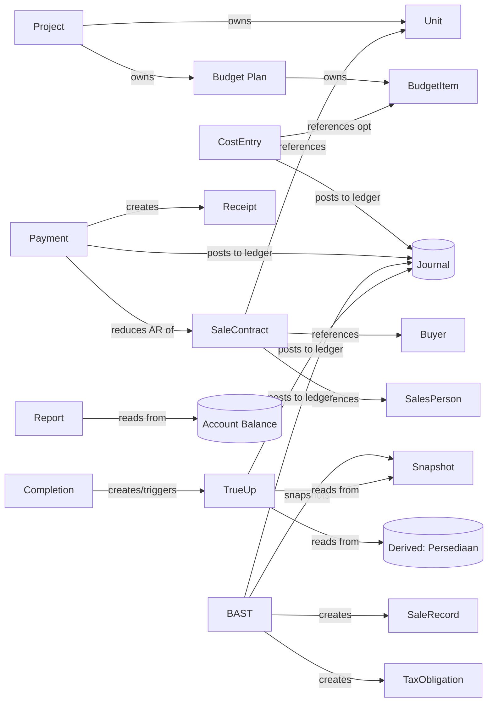

# esaProperti — ERP Blueprint Review (Enterprise Architecture)

> Peran: **Enterprise ERP Architect**, bukan programmer. Tujuan: memastikan domain
> **matang & tahan 2–3 tahun tanpa refactor besar** sebelum coding dilanjutkan.
> **Tidak ada implementasi/migration/API di dokumen ini.**
> Melengkapi: `business-architecture.md` (flow), `domain-model.md` (entity detail),
> `p0-4-completion-true-up-design.md` (closing).

**Horizon tag** (kematangan domain ≠ waktu build):
- **CORE** — dimodelkan & dibangun di program berjalan.
- **P2** — dimodelkan sekarang (sediakan *seam*), dibangun setelah core.
- **FUTURE** — placeholder domain; dibangun kemudian, harus **additive**.

---

## 1. Domain Completeness — audit entity yang hilang

| Entity | Perlu? | Horizon | Peran & alasan |
|---|---|---|---|
| **Vendor / Supplier** | ✅ | P2 | Master pihak pemasok/kontraktor — sumber biaya. (Gap lama.) |
| **Purchase Order (PO)** | ✅ | P2 | Komitmen beli (subkontraktor/material); **tanpa jurnal** (belum liability). |
| **Vendor Invoice / Bill** | ✅ | P2 | Tagihan vendor → **membuat AP**; jadi *source document* kapitalisasi biaya. |
| **Account Payable (AP)** | ✅ *(derived)* | CORE-derived | Saldo **Hutang Usaha 2-1xxx**; sudah bisa muncul sekarang (Cost Entry kredit Hutang). |
| **Bank Account** | ✅ *(master)* | CORE | Master rekening kas/bank (no rek, bank) yang **memetakan ke akun COA kas/bank**; dasar cash mgmt & rekonsiliasi. |
| **Cash** | ✅ *(derived)* | CORE-derived | Saldo akun kas/bank (1-1xxx). Bukan tabel. |
| **Fixed Asset** | ✅ | FUTURE | Aset kantor/kendaraan/pemasaran; aggregate sendiri, posting ke ledger. |
| **Depreciation** | ✅ | FUTURE | Run penyusutan → jurnal; akumulasi = derived (contra-asset). |
| **Sales Person** | ✅ *(master)* | P2 | Atribusi penjualan → performa marketing. |
| **Sales Team** | ✅ *(master)* | P2 | Pengelompokan sales; target tim. |
| **Commission** | ✅ | FUTURE | Commission Rule + Commission Entry; posting ke ledger. |
| **Tax Profile / Tax Rule** | ✅ | **CORE (refine now)** | Konfiguratif — **wajib sekarang** karena tarif sudah dipakai di BAST. Lihat §7. |
| **Approval Workflow** | ✅ | P2 | Engine approval generik (RAB, True-up, pembayaran besar). |
| **Permission / Approval Matrix** | ✅ | P2 | Role→hak + ambang approval (siapa boleh approve apa, sampai nominal berapa). |

### Tambahan spesifik developer properti (arsitek merekomendasikan)
| Entity | Perlu? | Horizon | Alasan |
|---|---|---|---|
| **Buyer → Customer Master** | ✅ | **CORE (refine)** | Naikkan dari `buyer_ref` string ke master (NPWP, kontak, joint-buyer, riwayat). |
| **Financing Source / KPR** | ✅ | P2 | Sumber dana Payment (pencairan bank KPR vs tunai) — penting untuk collection & AR. |
| **Transaction Fees (BPHTB, Notaris, PBB)** | ✅ | P2 | Biaya/pajak transaksi saat jual — via Tax Rule / fee obligation. |
| **Land Lot / Land Bank** | ➖ | FUTURE | Pelacakan akuisisi tanah; kini cukup kategori biaya `land`. |
| **Revenue Recognition Policy** | ⚠️ | **CORE-flag** | *Seam* metode pengakuan (point-in-time vs PSAK 72 over-time). Lihat §9 (risiko terbesar). |

**Kesimpulan §1:** tidak ada entity yang *salah*, tetapi ada **lubang di sisi
Procurement/AP, Treasury (Bank/Cash), Fixed Asset, Sales Performance, dan Tax
configurability**. Semua bisa ditambah **additive** karena ledger sudah menjadi
backbone (lihat §5 & §6) — kecuali **Revenue Recognition** yang harus di-*seam* sekarang.

---

## 2. Ownership Tree (ownership, bukan flow)

Ownership = **komposisi/lifecycle** (jika induk hilang, anak tak bermakna).
Yang bukan ownership ditandai *(ref)* = pointer ke entity lain.

```
Tenant (Company / Legal Entity)
├── Users ─ Roles ─ Permissions ─ Approval Matrix
├── Approval Workflows → Approval Steps   (config; Requests+Actions cross-cutting)
├── Chart of Accounts (COA)
├── Accounting Periods
├── Bank Accounts            (ref → COA cash/bank)
├── Tax Rules / Tax Profile
├── Vendors
│   ├── Purchase Orders           [P2]
│   ├── Vendor Invoices (Bills)   [P2]  → AP (derived)
│   └── Vendor Payments           [P2]
├── Buyers (Customer Master)
│   ├── Sale Contracts       (ref → Unit)
│   ├── Payments
│   ├── Buyer Credits
│   └── Outstanding / AR (derived)
├── Sales Teams
│   └── Sales Persons        (ref ← Sale Contract atribusi)
├── Fixed Assets            [FUTURE]
│   └── Depreciation Runs   [FUTURE]
└── Projects  ★ AGGREGATE ROOT
    ├── Phases
    │   └── Units  (+ Lifecycle status & Transition history — §9)
    ├── Budget Plans (RAB)
    │   └── Budget Items
    ├── Allocation Basis (+versions)
    ├── Cost Entries         (ref → Budget Item?, Vendor?)
    ├── Sales (per Unit)
    │   ├── Sale Contract     (ref → Buyer, Sales Person)
    │   ├── Payment Schedule
    │   ├── Payments → Allocations → (Buyer Credit)
    │   └── Invoices / Receipts
    ├── Recognition (per Unit)
    │   ├── BAST / Sale Record
    │   ├── HPP Allocation Snapshot   (snapshots RAB version + basis)
    │   └── Tax Obligation → Tax Payment
    ├── Completion Event
    ├── True-up Runs → True-up Lines
    └── Project Reports (views, read-only)

Unit  (dimiliki Project, tapi menjadi "pusat siklus jual")
├── Sale Contract (1)
├── Payment Schedule
├── Payments (via contract)
├── BAST / Sale Record
└── HPP Snapshot
```

**Aturan anti-"entity mengambang":** setiap entity WAJIB punya **tepat satu owner**
(Tenant, Project, Buyer, Vendor, Sale Contract, Unit, atau Journal Entry). Bila
sebuah entity tak punya owner jelas → ia salah tempat.

---

## 3. Relationship Type (relasi berlabel)

Enam jenis relasi baku. Developer baru cukup baca label:

| Label | Arti | Contoh |
|---|---|---|
| **owns** | komposisi/lifecycle, cascade | Project **owns** Phase; Budget Plan **owns** Budget Item; Journal Entry **owns** Journal Line; Sale Contract **owns** Payment Schedule |
| **references** | pointer/asosiasi, **tanpa** cascade | Sale Contract **references** Buyer, Unit, Sales Person; Cost Entry **references** Budget Item (opsional), Vendor |
| **posts to ledger** | membuat Journal Entry (Dr/Cr) | Cost Entry, Payment, BAST, True-up, Tax, Depreciation **posts to ledger** |
| **reads from** | derivasi/kueri, tak menulis | Report **reads from** Account Balance; True-up **reads from** Snapshot + Inventory |
| **creates** | menghasilkan dokumen/event hilir | BAST **creates** Sale Record + Snapshot + Tax Obligation; Payment **creates** Receipt; Completion **creates** True-up |
| **snapshots** | pembekuan immutable satu kali | BAST **snapshots** RAB version + basis + identitas unit → Allocation Snapshot |



---

## 4. Project sebagai Aggregate Root — konfirmasi

**Global Master (boleh hidup tanpa Project):** Tenant, User/Role/Permission, COA,
Accounting Period, Bank Account, Tax Rule, Vendor, Buyer, Sales Team/Person,
Fixed Asset. Ini data acuan lintas-project.

**Semua sisanya WAJIB di bawah Project** (tak bisa berdiri sendiri): RAB, Budget
Item, Allocation Basis, Cost Entry, Sale Contract, Payment Schedule, Payment,
Payment Allocation, Buyer Credit, Invoice, Receipt, BAST, Sale Record, Snapshot,
Tax Obligation/Payment, Completion, True-up, Project Report.

**Uji "aggregate root":** setiap transaksi harus bisa dijawab *"Project mana?"*.
Jika sebuah dokumen finansial tak punya project (mis. biaya kantor umum) → ia
**bukan** milik Project melainkan milik **Tenant** (overhead) dan diposting ke akun
beban umum, bukan ke Persediaan proyek. (Ini memisahkan biaya proyek vs overhead —
penting agar HPP tidak tercemar.)

---

## 5. Accounting Backbone — semua angka dari Ledger

**Prinsip absolut:** *tidak ada saldo yang disimpan sendiri.* Semua balance =
Σ Journal Line per akun per periode. Report **hanya** membaca Journal Line /
Account Balance.

| Derived balance | Dari akun COA | Dibaca oleh |
|---|---|---|
| **Inventory / Persediaan** | 1-3xxx | BAST, True-up, Neraca |
| **AR / Piutang** | 1-2000 | AR Aging, Neraca |
| **AP / Hutang Usaha** | 2-1xxx | AP Aging, Neraca |
| **Cash / Bank** | 1-1xxx | Cash position, Neraca |
| **Uang Muka Penjualan** | 2-2000 | Neraca (liability pra-BAST) |
| **Accumulated Depreciation** | 1-6xxx (contra) | Neraca *(FUTURE)* |
| **HPP / COGS** | 5-1000 | L/R |
| **Tax Payable** | 2-3xxx (PPN), 2-4xxx (PPh) | Neraca |
| **Revenue** | 4-xxxx | L/R |

Konsekuensi desain: **AP, Cash, Depreciation, Commission payable** yang belum ada
**tidak** butuh tabel saldo — cukup akun COA + posting; saldonya derived. Inilah
kunci "additive tanpa refactor".

---

## 6. Future-proof — cara tiap modul masa depan menempel tanpa ubah inti

| Modul masa depan | Seam (titik tempel) | Kenapa additive |
|---|---|---|
| **AP & Vendor Invoice** | Cost Entry sudah bisa kredit **Hutang (2-1xxx)**; tambah dokumen Vendor Invoice (Dr Persediaan/Beban · Cr AP) + Vendor Payment (Dr AP · Cr Bank). AP = derived. | Ledger sudah memodelkan Hutang; hanya menambah dokumen sumber. |
| **Purchase Order** | Dokumen komitmen **tanpa jurnal**; Vendor Invoice me-*reference* PO. | Tidak menyentuh ledger; murni menambah dokumen hulu. |
| **Bank & Cash Management** | Bank Account master **reference** akun COA kas/bank; transfer antar-bank = jurnal biasa; rekonsiliasi = read. | Saldo kas tetap derived; hanya menambah master + view. |
| **Fixed Asset & Depreciation** | Aggregate baru; Depreciation Run **posts to ledger**; akumulasi derived. | Tak menyentuh siklus proyek/HPP. |
| **Sales Person / Team** | **reference** di Sale Contract/BAST (`sales_person_id`); metrik = read. | Reservasi 1 kolom referensi; sisanya read-model. |
| **Commission** | Commission Rule (config) + Commission Entry **posts to ledger** (Dr Beban Komisi · Cr Utang Komisi) dipicu BAST/collection. | Berdiri di atas atribusi sales + ledger. |
| **Approval Workflow** | Membungkus transisi approve yang sudah ada (RAB approve, True-up approve) via Approval Matrix. | Cross-cutting; state approval jadi generik. |
| **Multi-Project** | Sudah didukung (banyak Project per Tenant). | — |
| **Multi-Company (grup)** | Tenant = **legal entity/company** sekarang. Grup multi-PT = tambah parent **Organization/Group** (opsional) + konsolidasi read-model. COA/periode/ledger tetap per-company. | Tenant tidak diasumsikan "grup"; menambah lapisan di atas = additive. |

**Aturan future-proof:** jangan pernah menaruh angka finansial di luar ledger;
selalu *reference* master global daripada menyalin; sediakan kolom referensi
(sales_person, vendor, financing_source) lebih awal walau modulnya belum dibangun.

---

## 7. Tax Architecture — konfiguratif, TIDAK hardcode

**Masalah:** tarif PPh Final berbeda per jenis proyek (Subsidi **1%**, Komersial
**2,5%**), dan regulasi berubah. Tarif **tidak boleh** di kode.

**Model:**
- **Project.tax_category** — `subsidi | komersial` (atribut proyek).
- **Tax Rule** (master konfiguratif), minimal:
  | Field | Contoh |
  |---|---|
  | `tax_type` | `pph_final` \| `ppn` \| `bphtb` |
  | `name` | "PPh Final Properti Subsidi" |
  | `rate` | `0.010000` |
  | `calc_base` | DPP (harga jual neto) |
  | `trigger_event` | `bast` \| `invoice` \| `payment` |
  | `applies_to` | `subsidi` \| `komersial` \| `all` \| tipe unit |
  | `debit_account` / `credit_account` | kode COA jurnal |
  | `effective_from` / `effective_to` | tanggal berlaku |
  | `active` | boolean |

- **Resolusi saat trigger (mis. BAST):** pilih Tax Rule dimana `tax_type` cocok,
  `applies_to` cocok dengan `Project.tax_category`, dan
  `effective_from ≤ tanggal_event ≤ effective_to`. Hitung `rate × DPP` →
  **Tax Obligation** dengan akun jurnal dari rule.

**Contoh konfigurasi:**
| Rule | rate | applies_to | trigger | Dr / Cr |
|---|---|---|---|---|
| PPh Final Subsidi | 1% | subsidi | bast | Dr PPh Final · Cr Utang PPh Final |
| PPh Final Komersial | 2,5% | komersial | bast | Dr PPh Final · Cr Utang PPh Final |
| PPN Keluaran | 11% | komersial | bast/invoice | Dr Piutang · Cr PPN Keluaran |

**Hasil:** regulasi berubah (mis. PPN 11%→12%, atau tarif subsidi baru) = **tambah/
ubah baris Tax Rule dengan `effective_from` baru** — **tanpa ubah kode**. Snapshot
BAST tetap membekukan tarif yang dipakai (historical), konsisten dengan §5 & prinsip
immutability.

---

## 8. Sales Performance — domain (belum implementasi)

- **Sales Person** (master): kode, nama, tim, tanggal gabung, status; opsional
  `references` User.
- **Sales Team** (master): nama, leader (Sales Person), target.
- **Atribusi**: Sale Contract `references` Sales Person (primary; dukung split di
  masa depan). BAST mewarisi atribusi.
- **Metrik (read-model, dari ledger + kontrak):** jumlah closing, nilai penjualan
  (Σ kontrak/BAST), outstanding customer (AR per buyer salesperson), **collection
  rate** (paid ÷ tagihan), ranking tim.
- **Commission** (FUTURE): Commission Rule (tier per team/person/project) +
  Commission Entry (dipicu BAST atau milestone collection) `posts to ledger`.

**Seam sekarang:** cukup reservasi referensi `sales_person_id` (dan `sales_team_id`)
di Sale Contract. Semua metrik & komisi menyusul sebagai read-model/modul additive.

---

## 9. Self-Review sebagai ERP Architect

### Apakah layak jadi SSOT 2–3 tahun?
**Ya, dengan syarat 3 hal dikunci sekarang:** (a) **ledger-centric** — semua saldo
derived (§5); (b) **Project aggregate root** + Global Master terpisah (§4); (c)
**Tax Rule konfiguratif** (§7). Dengan itu, penambahan AP, Bank/Cash, Fixed Asset,
Sales/Commission, Approval, Multi-company semuanya **additive** (§6) — tidak memaksa
refactor inti.

### Blind spot yang saya temukan
1. **Revenue Recognition method (RISIKO TERBESAR).** Model sekarang mengakui
   pendapatan **point-in-time saat BAST**. PSAK 72 dapat menuntut pengakuan
   **over-time (percentage-of-completion)** untuk unit pre-sold pada kondisi
   tertentu. Jika ini muncul, timing pengakuan Pendapatan+HPP **berubah fundamental**.
   **Mitigasi wajib sekarang:** perlakukan pengakuan sebagai **Revenue Recognition
   Policy (seam)** di level Project/kontrak — jangan hardcode "revenue = saat BAST".
   BAST tetap event serah terima; *policy* yang menentukan kapan pendapatan diakui.
2. **Multi-company/legal entity.** Tenant kini = company. Bila klien tumbuh jadi grup
   multi-PT dengan konsolidasi, butuh lapisan Organization/Group + eliminasi
   inter-company. Additive, tapi **jangan** menaruh asumsi "1 user = 1 company global".
3. **Buyer master dangkal.** `buyer_ref` string berisiko untuk joint-buyer, NPWP,
   riwayat lintas-unit, dan pelaporan collection per customer. Naikkan ke Customer
   master **sebelum** volume data besar (migrasi makin mahal seiring waktu).
4. **Refund/Pembatalan.** Buyer batal setelah beberapa termin → butuh alur reversal
   + pengembalian + pelepasan unit ke `available`. Harus lewat jurnal pembalik
   (sudah sejalan append-only), tapi *state transition*-nya perlu didesain.
5. **Overhead vs project cost.** Biaya umum (gaji kantor) **bukan** HPP proyek —
   pastikan ada jalur beban Tenant-level agar Persediaan/HPP tidak tercemar (§4).
6. **Document/attachment & audit log** (bukti PPJB, faktur pajak) — cross-cutting,
   additive, tapi perlu tempat sejak awal.

### Relasi yang berpotensi refactor besar bila diabaikan
| Area | Risiko | Mitigasi sekarang |
|---|---|---|
| **Revenue recognition** | Tinggi | Seam "Recognition Policy"; jangan kunci di BAST |
| **Tax hardcode** | Tinggi → **sudah dimitigasi** | Tax Rule konfiguratif (§7) |
| **AP/procurement telat** | Sedang → mitigasi ledger | Cost Entry kredit Hutang; AP derived (§6) |
| **Sales attribution telat** | Sedang | Reservasi `sales_person_id` di kontrak sekarang |
| **Multi-company** | Sedang | Tenant = company; group = parent additive |
| **Buyer master** | Sedang | Upgrade ke Customer master lebih awal |

### Putusan arsitek
Blueprint **layak menjadi Single Source of Truth** untuk 2–3 tahun **setelah**
menambahkan ke domain: **Vendor/AP chain, Bank Account, Tax Rule konfiguratif,
Customer master, Sales Person/Team, dan seam Revenue Recognition Policy** (semua
di §1–§8). Selama prinsip **ledger-as-backbone** dan **Project-as-aggregate-root**
dipatuhi, sisanya tumbuh additive. **Satu hal yang tidak boleh ditunda: kunci
Revenue Recognition sebagai policy, bukan asumsi.**

---

## Rekomendasi urutan (domain → nanti implementasi)
> Diperbarui setelah lock 8 domain — detail di **`blueprint-domain-additions.md`**.

1. **Kunci sekarang (CORE):** Tax Rule konfiguratif · Customer master · Recognition
   Policy **strategy seam** (PIT default) · Bank Account master · **Cost Allocation
   3-tier (Direct/Shared/Overhead)** · **Payment Source/Scheme** · **Refund/Cancellation**
   · **Booking (+ booking fee)** · **Unit Lifecycle (state machine + transition log)** ·
   **Generic Approval Workflow (governance; RAB & True-up jadi konsumen pertama)**.
2. **SEAM (model sekarang, bangun kemudian):** Sales Commission (Rule→Approval→Payment)
   · Document Management (PPJB/AJB/SHM/PBG-IMB/BAST) · Financing/KPR source · Lead/CRM.
3. **P2:** Vendor + Vendor Invoice + PO + AP flow (+ PPN Masukan) · Sales Person/Team ·
   Approval Matrix · Marketing Target & KPI (read-model).
4. **FUTURE:** Fixed Asset + Depreciation · Commission payout aktif · Multi-company group
   · Percentage-of-Completion recognition.

> Tidak ada kode/migration/API dibuat. Menunggu approval blueprint sebelum lanjut.
