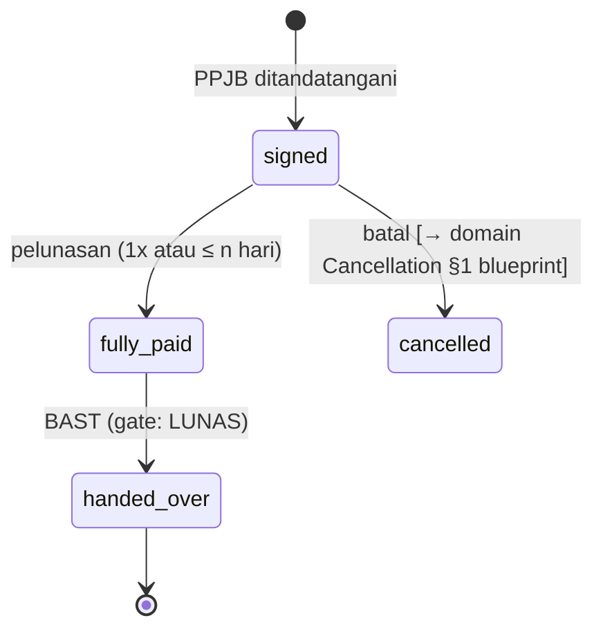
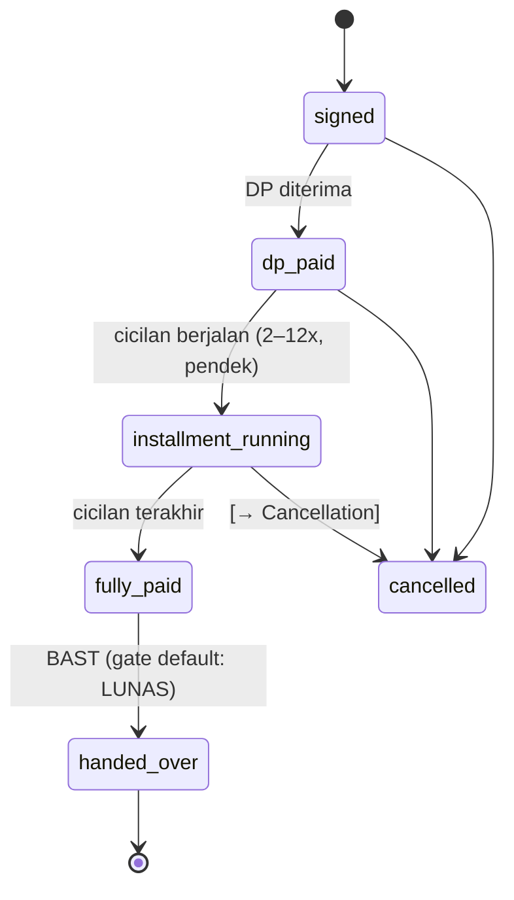

# Increment 3 — Payment Scheme (Strategy Seam) — DESIGN REVIEW

> Status: **APPROVED (2026-07-03) dengan penyempurnaan §11 — implementasi berjalan.**
> D1–D5 disetujui. Empat catatan approval dari owner dimasukkan di §11 dan
> MENGIKAT implementasi.
> Blueprint: `blueprint-domain-additions.md` §5 (CORE) + §8 (pola seam).
> Prinsip locked yang dipatuhi: ledger-centric, Project aggregate root, append-only,
> snapshot immutable, Tax Rule konfiguratif, strategy seam (pola Revenue Recognition).

---

## 0. Baseline kode saat ini (fakta, bukan asumsi)

| Yang ada sekarang | Masalah |
|---|---|
| `sale_contracts.payment_type` string `kpr\|tunai` | Bukan seam — hanya label; tidak menggerakkan perilaku apa pun |
| `sale_contracts.bank_kpr` **free-text** + `loan_amount` | Data debt: bank tidak ter-master; tak bisa AP/AR per bank, tak bisa reporting |
| Payment Schedule dibuat **manual penuh** (`CreatePaymentSchedule(items)`) | Tidak ada pola per skema; tidak ada validasi Σ = kontrak |
| `ReceivePayment` = pintu tunggal; routing pra-BAST→2-2000, pasca-BAST→1-2000 | ✅ SEHAT — tidak diubah increment ini |
| `payment_allocations` sub-ledger + buyer credit (FE-2/FE-3) | ✅ SEHAT — scheme-agnostic, tidak diubah |
| Booking, Cancellation/Refund, Approval engine, Unit Lifecycle | **Blueprint LOCKED, belum ada di kode** — desain ini mendefinisikan seam ke sana, TIDAK membangunnya |
| Kebijakan Increment 1 (LOCKED): kontrak baru wajib `customer_id`+`sales_person_id` "saat alur kontrak di-rewire" | Increment 3 me-rewire alur kontrak ⇒ **enforcement jatuh tempo di increment ini** |

---

## 1. Review blueprint — blind spot & potensi refactor

Blueprint §5 sudah benar arah (scheme di kontrak, source di payment, Financing Source
seam, AR per counterparty). Blind spot yang saya temukan — **semua bisa ditutup
sekarang secara additive; jika diabaikan menjadi refactor besar nanti**:

| # | Blind spot | Dampak jika diabaikan | Mitigasi (di desain ini) |
|---|---|---|---|
| BS-1 | **AR tidak punya dimensi counterparty di ledger.** "AR pindah ke bank" (akad KPR) tak bisa diekspresikan pada satu akun 1-2000 | Aging/risiko KPR vs buyer tercampur; laporan ke bank tak bisa; refactor query AR di mana-mana | Sub-akun COA baru **`1-2200 Piutang Bank (KPR)`**; perpindahan = jurnal reklas (append-only). AR total tetap derived |
| BS-2 | **Presisi "AR pindah ke bank":** pra-BAST tidak ada AR di ledger (uang masuk = Uang Muka 2-2000; outstanding = kontraktual). AR ledger baru lahir saat BAST | Salah desain jurnal akad (mereklas AR yang belum ada) | State scheme menentukan **counterparty saat BAST** dan reklas **hanya** pasca-BAST (tabel §6) |
| BS-3 | `bank_kpr` free-text | Master bank tak pernah bisa dibangun tanpa migrasi data kotor | **Financing Source master** (thin) sekarang; `bank_kpr` jadi legacy read-only |
| BS-4 | **Parameter scheme berubah setelah kontrak jalan** | HPP-gate/jadwal kontrak lama ikut berubah diam-diam | **Snapshot parameter di kontrak** saat teken (pola `VATRateSnapshot` — snapshot immutable) |
| BS-5 | **Reschedule/konversi scheme butuh versi jadwal.** Baris jadwal sekarang flat; edit = hilang audit | KPR ditolak / reschedule = UPDATE-in-place → audit hancur, aging salah | **Supersede pattern** pada schedule (pola BudgetPlan): baris lama `superseded`, baris terbayar TIDAK disentuh |
| BS-6 | **Bunga/margin cicilan inhouse** = pendapatan bunga terpisah dari harga unit (PSAK 72 komponen pembiayaan) | Pengakuan pendapatan salah jika dicampur | Increment ini: jadwal **zero-interest** (harga final sudah termasuk margin). Seam kolom disediakan; `// TODO(tax-advisor)` |
| BS-7 | Increment-1 contract policy jatuh tempo (customer/salesperson wajib) | Kontrak baru terus memakai buyer free-text | Enforcement masuk scope increment ini |

**Kesimpulan §1: tidak ada perubahan arsitektur inti yang dibutuhkan.** Semua
mitigasi additive (akun COA, tabel baru, kolom nullable, pola supersede yang sudah
ada presedennya). Ledger backbone & aggregate root tidak tersentuh.

---

## 2. Domain Model

### Entity / Value Object / Policy / Aggregate map

| Objek | Jenis | Owner | Keterangan |
|---|---|---|---|
| **PaymentScheme** | Entity (config master) | **Tenant** (aggregate sendiri, pola Tax Rule) | `code` (immutable), `name`, `policy_type` (binding ke strategy), parameter default, `active`, `effective_from/to` |
| **SchemeParams** | **Value Object** | — | Parameter terketik: `dp_percent`, `installment_count`, `tenor_months`, `bast_gate`, `allow_overpay_credit`… Divalidasi oleh policy-nya |
| **SchemeParamsSnapshot** | Value Object (frozen) | SaleContract | Salinan immutable parameter saat kontrak dibuat (BS-4) |
| **PaymentSchemePolicy** | **Domain Policy (strategy interface)** | — (pure domain, tanpa DB) | Perilaku per `policy_type` — §3 |
| **FinancingSource** | Entity (master, thin) | **Tenant** | Bank penyalur: `code`, `name`, `type` (`bank_kpr_subsidi\|bank_kpr_komersial\|lainnya`). Blueprint SEAM → dibangun thin sekarang (BS-3) |
| **SaleContract** | Aggregate (existing) | Unit/Project | **+`payment_scheme_id` (reference)**, `+scheme_state`, `+financing_source_id` (nullable ref), `+params_snapshot`. `payment_type/bank_kpr` legacy read-only |
| **ContractFinancingEvent** | Entity (append-only log) | SaleContract | Riwayat milestone scheme: submitted→approved→akad→disbursed, rejected, **take-over/ganti bank** (BS: KPR take over). Tidak pernah di-update |
| **PaymentSchedule** | Entity (existing) | SaleContract | +status `superseded` (BS-5). Tetap TIDAK posting jurnal |
| **Payment / TerminPayment** | Entity (existing) | Unit/Contract | +`financing_source_id` nullable (pencairan KPR ter-tag). `payment_source` diperluas: `kpr_disbursement` |
| **PaymentAllocation / BuyerCredit** | Entity (existing) | — | **Tidak berubah** — scheme-agnostic |
| **AR per counterparty** | **Read Model** | — | Derived: 1-2000 (buyer) + 1-2200 (bank) per contract/financing source |
| **Collection per scheme / aging per scheme** | Read Model | — | Derived dari schedule + alokasi + atribusi scheme |
| **Ledger Posting** | — | — | HANYA dari: ReceivePayment (existing), BAST (existing), **reklas akad** (baru, §6). PaymentScheme & Schedule TIDAK PERNAH posting |

### Ownership (melengkapi pohon blueprint §2)

```
Tenant
├── Payment Schemes (config, pola Tax Rule)        ← BARU
├── Financing Sources (master bank)                ← BARU (thin)
└── Projects ★
    └── Sales (per Unit)
        ├── Sale Contract ──references──▶ Payment Scheme (+ params snapshot beku)
        │                 ──references──▶ Financing Source (KPR)
        │   ├── owns Scheme State (state machine §4)
        │   ├── owns Contract Financing Events (append-only)
        │   └── owns Payment Schedule (+ supersede)
        └── Payments → Allocations → (Buyer Credit)   [tidak berubah]
```

---

## 3. Strategy Pattern — interface, implementasi, registry

### Interface (pure domain — tanpa DB, tanpa HTTP, sesuai aturan package)

```go
// internal/domain (atau internal/scheme/policy) — deskriptif, bukan kode final
type PaymentSchemePolicy interface {
    // Identitas strategy — nilai kanonik bertipe (SSOT, pola CostTier).
    PolicyType() SchemePolicyType // cash | cash_installment | kpr | inhouse

    // Validasi kontrak saat dibuat (mis. KPR wajib financing_source + loan_amount;
    // cash tidak boleh punya tenor).
    ValidateContract(p SchemeParams, c ContractFacts) error

    // Usulan jadwal (§5): deterministik, Σ == GrossAmount persis (largest-remainder,
    // Invariant #3). User boleh override manual — policy memvalidasi hasil akhir.
    BuildSchedulePlan(p SchemeParams, c ContractFacts) ([]ScheduleItem, error)

    // State machine milik scheme (§4): transisi sah per state.
    AllowedTransitions() map[SchemeState][]SchemeState

    // Counterparty piutang PADA SAAT BAST (buyer | bank) berdasarkan state (BS-2).
    ARCounterparty(state SchemeState) ARCounterparty

    // Gate BAST per scheme (dari params, bukan hardcode):
    // cash: lunas penuh; kpr: minimal akad; inhouse: DP terbayar (configurable).
    CanBAST(p SchemeParams, state SchemeState, facts PaymentFacts) error
}
```

Empat implementasi awal: **CashPolicy**, **CashInstallmentPolicy**, **KPRPolicy**,
**InHousePolicy**.

### Registry & future-proofing

```
registry: map[SchemePolicyType]PaymentSchemePolicy   (diisi di wiring, immutable saat runtime)

payment_schemes (DB rows, per tenant):
  code        name                     policy_type        params(default)
  CASH        "Tunai Keras"            cash               {bast_gate: full_payment}
  CASH-3X     "Tunai Bertahap 3x"      cash_installment   {installment_count: 3, ...}
  KPR-SUB     "KPR Subsidi"            kpr                {dp_percent: 1, bast_gate: akad}
  KPR-KOM     "KPR Komersial"          kpr                {dp_percent: 10, ...}
  INH-36      "In-House 36 bulan"      inhouse            {tenor_months: 36, bast_gate: dp_paid}
```

- **Varian baru = baris config baru** (tanpa kode): "KPR Komersial DP 20%" = row baru
  policy_type `kpr` dengan params beda.
- **Perilaku baru = satu policy baru + satu entri registry** (mis. `rent_to_own`,
  `cash_progress` 5 tahun lagi) — Sale Contract, ReceivePayment, allocation,
  ledger TIDAK tersentuh, karena semuanya bicara lewat interface + tag.
- Kontrak menyimpan `payment_scheme_id` + **params snapshot** ⇒ mengubah/menonaktifkan
  scheme master tidak mengubah kontrak berjalan (BS-4).
- Tidak ada `if scheme == "kpr"` di service mana pun — semua keputusan perilaku
  lewat policy; pelanggaran = gagal review (pola larangan raw-string CostTier).

---

## 4. Lifecycle per scheme — state machines

`scheme_state` milik SaleContract; transisi hanya yang diizinkan policy; setiap
transisi tercatat di `contract_financing_events` (append-only, siapa/kapan/ref).
Booking & PPJB berada di domain Booking/Unit Lifecycle (blueprint §2/§9 — belum
dibangun); state machine scheme **dimulai saat kontrak (PPJB) ditandatangani** dan
menyediakan seam ke Booking (booking fee → bagian DP) & Cancellation.

### Cash (tunai keras)



### Cash Bertahap



### KPR

```mermaid
stateDiagram-v2
  [*] --> signed
  signed --> dp_paid: DP ke developer
  dp_paid --> submitted_to_bank: berkas diajukan
  submitted_to_bank --> bank_approved: SP3K terbit
  submitted_to_bank --> bank_rejected: ditolak
  bank_rejected --> submitted_to_bank: GANTI BANK (financing event baru)
  bank_rejected --> converted: konversi scheme → inhouse/cash [approval]
  bank_approved --> akad: akad kredit
  akad --> disbursed: pencairan bank (Dr Bank / Cr Uang Muka|Piutang Bank)
  akad --> handed_over: BAST (gate default: AKAD)
  disbursed --> handed_over: BAST
  handed_over --> disbursed_post: pencairan setelah BAST (reklas AR → bank, §6)
  signed --> cancelled
  dp_paid --> cancelled: [→ Cancellation; refund DP sesuai PPJB]
  handed_over --> [*]
  disbursed_post --> [*]
```



*Take-over KPR pasca-akad* (buyer pindah bank): `disbursed → disbursed` dengan
financing event `takeover` + reklas antar sub-piutang bank — tidak butuh state baru.

### In-House

```mermaid
stateDiagram-v2
  [*] --> signed
  signed --> dp_paid: DP diterima
  dp_paid --> installment_running: cicilan jangka panjang (12–60 bln)
  dp_paid --> handed_over: BAST awal (gate default: DP_PAID — praktik umum:\nbuyer menghuni sambil mencicil; sisa jadi AR 1-2000)
  installment_running --> handed_over: BAST
  handed_over --> installment_running_postbast: cicilan berlanjut (bayar → Cr Piutang)
  installment_running_postbast --> fully_paid: lunas (percepatan diizinkan)
  installment_running --> fully_paid: lunas sebelum BAST
  fully_paid --> handed_over: BAST (jika belum)
  signed --> cancelled
  dp_paid --> cancelled
  installment_running --> cancelled: [→ Cancellation]
  fully_paid --> [*]
```

**Gate BAST configurable per scheme row** (param `bast_gate`:
`full_payment | akad | dp_paid`), dieksekusi `CanBAST()` — bukan hardcode.
Gate ini MENAMBAH gate BCA-2 existing (RAB approved + basis), tidak menggantikan.

---

## 5. Pemisahan tanggung jawab — Scheme vs Schedule vs Allocation

| Lapisan | Tanggung jawab | Yang BUKAN tanggung jawabnya |
|---|---|---|
| **Payment Scheme (policy)** | ATURAN: validasi kontrak, **mengusulkan** rencana jadwal (`BuildSchedulePlan`), state machine, counterparty AR, gate BAST | TIDAK menyimpan uang, TIDAK posting jurnal, TIDAK tahu pembayaran individual |
| **Payment Schedule** | DOKUMEN TAGIHAN: baris cicilan (jumlah, jatuh tempo, tipe), status turunan (scheduled/due/overdue/received), versi (supersede saat reschedule) | TIDAK posting jurnal (aturan existing dipertahankan), TIDAK menghitung dirinya sendiri (dibentuk dari plan policy / input manual tervalidasi) |
| **Payment (termin) via ReceivePayment** | UANG MASUK: satu-satunya pintu; posting jurnal (routing pra/pasca-BAST); idempoten; kwitansi | TIDAK memutuskan pola jadwal |
| **Payment Allocation** | SUB-LEDGER: memetakan uang → cicilan (partial, auto-order jatuh tempo, buyer credit utk overpay) | TIDAK peduli scheme — uang adalah uang (tetap scheme-agnostic, tidak diubah) |

**Alur pembentukan jadwal:**
1. Kontrak dibuat dengan `payment_scheme_id` → policy `ValidateContract`.
2. `BuildSchedulePlan(params, contract)` → **usulan** baris (DP/installment/final),
   Σ == GrossAmount **persis** (largest-remainder, Invariant #3).
3. User boleh menyesuaikan manual (praktik nyata: nego per buyer) → policy
   **memvalidasi hasil akhir** (Σ benar, struktur sesuai scheme — mis. cash tidak
   boleh 24 baris).
4. Reschedule/konversi = generate versi baru, baris belum-terbayar `superseded`,
   baris terbayar tidak disentuh (audit; BS-5).

---

## 6. Dampak ke Ledger — per business event

Prinsip tetap: **tidak ada pendapatan di event pembayaran mana pun** (Invariant #7);
pendapatan hanya di BAST (Recognition Policy — seam terpisah). Akun baru: **`1-2200
Piutang Bank (KPR)`** (seed COA + migrasi tenant existing).

| Business Event | Journal Entry | AR | Cash | Liability | Revenue |
|---|---|---|---|---|---|
| Booking fee *(domain Booking — future)* | Dr Bank / Cr Titipan Booking 2-2xxx | — | ↑ | ↑ (titipan) | — |
| **DP / cicilan pra-BAST** (semua scheme) | Dr Bank / Cr **Uang Muka 2-2000** | — | ↑ | ↑ | — |
| **Pencairan KPR pra-BAST** (source=`kpr_disbursement`, tag financing_source) | Dr Bank / Cr **Uang Muka 2-2000** | — | ↑ | ↑ | — |
| **BAST** — counterparty sisa tagihan dari `ARCounterparty(state)` | Dr Uang Muka 2-2000 (yg diterima) + Dr **Piutang 1-2000 (buyer)** ATAU **1-2200 (bank, jika akad sudah terjadi)** / Cr Pendapatan (DPP) + Cr PPN Keluaran | ↑ (sisa) | — | ↓ (uang muka habis) | **↑ (satu-satunya titik)** |
| **Akad terjadi SETELAH BAST** (KPR; AR pindah ke bank) | **Reklas: Dr 1-2200 / Cr 1-2000** (tanpa P&L) | netral (pindah counterparty) | — | — | — |
| **Pencairan KPR pasca-BAST** | Dr Bank / Cr **1-2200** | ↓ (bank) | ↑ | — | — |
| **Cicilan inhouse pasca-BAST** | Dr Bank / Cr **1-2000** | ↓ (buyer) | ↑ | — | — |
| **Take-over bank** (pasca-akad) | Reklas antar tag financing di 1-2200 + financing event | netral | — | — | — |
| Overpayment pra-BAST | Dr Bank / Cr 2-2000 (kelebihan → Buyer Credit sub-ledger, existing) | — | ↑ | ↑ | — |
| Pembatalan / refund / DP hangus | *(domain Cancellation §1 blueprint — jurnal pembalik + forfeit → Pendapatan Lain; BUKAN scope increment ini)* | | | | |

Routing pra/pasca-BAST yang existing (GAP-1) **tidak berubah** — scheme hanya
menambah (a) counterparty saat BAST, (b) event reklas akad, (c) tag financing source.

---

## 7. Approval Workflow — perlu, di event mana

Perlu — **sebagai gate yang didefinisikan sekarang, ditegakkan saat engine Approval
Workflow dibangun** (blueprint §10 CORE-governance, belum ada di kode; increment ini
tidak membangunnya). Event yang di-desain ber-gate (`target_type` polimorfik):

| Event | Kenapa butuh approval |
|---|---|
| **Konversi scheme** (KPR ditolak → inhouse/cash) | Mengubah profil risiko AR & jadwal; rawan abuse |
| **Reschedule cicilan** (supersede jadwal) | Mengubah aging & proyeksi kas |
| **Diskon pelunasan dipercepat** (jika > ambang) | Mengurangi nilai kontrak (blueprint: Discount) |
| Perubahan master Payment Scheme (params default) | Governance config (pola RAB approve) — P2 |

Sampai engine ada: transisi ini tetap tersedia via endpoint biasa dengan audit
`created_by` + financing event log; kolom `approval_request_id` (nullable) disiapkan
di desain schema agar wiring nanti additive.

## 8. Tax Rule — perlu, di event mana

- **Scheme TIDAK menentukan pajak.** Penentu tarif tetap `Project.tax_category`
  (subsidi 1% / komersial 2,5%) — blueprint §7 eksplisit melarang mencampur
  (KPR-subsidi ≠ pajak-subsidi; bank subsidi hanya atribut financing source).
- Event pajak existing tidak berubah: **PPN** snapshot di kontrak (PKP), akrual di
  BAST; **PPh Final** akrual di BAST.
- Baru yang perlu dicatat sebagai seam Tax Rule (bukan increment ini):
  **BPHTB/AJB/biaya balik nama** ter-trigger di sekitar akad/AJB (blueprint §1 tabel
  Tax Rule sudah menyediakan `trigger_event`); **bunga inhouse** jika suatu saat
  ada → `// TODO(tax-advisor): perlakuan PPh/PPN pendapatan bunga cicilan inhouse`.

## 9. Dependensi domain lain

| Domain | Perlu? | Bentuk keterlibatan di Increment 3 |
|---|---|---|
| **Customer** | **YA — wajib** | Alur kontrak di-rewire ⇒ kebijakan LOCKED Increment 1 jatuh tempo: kontrak baru **wajib `customer_id`**; `buyer_name/buyer_id` legacy read-only |
| **Sales Person** | **YA — wajib** | Sama: kontrak baru wajib `sales_person_id` (atribusi; komisi future membacanya) |
| **Booking** | Seam saja | Belum dibangun; state machine scheme mulai di `signed`. Booking fee → bagian DP didefinisikan di increment Booking (§2 blueprint) |
| **Cancellation** | Seam saja | State `cancelled` ada di semua scheme sebagai TARGET transisi; jurnal pembalik/refund/forfeit = increment Cancellation (§1 blueprint) |
| **Refund** | Seam saja | Termasuk paket Cancellation; KPR ditolak → refund DP mengikuti aturan PPJB |
| **Commission** | Tidak (SEAM) | Scheme menyediakan data trigger masa depan (BAST / collection milestone); tidak ada kode komisi |

## 10. Blind spot PSAK / praktik developer Indonesia — analisis risiko

| Kasus | Penanganan di desain ini | Risiko refactor |
|---|---|---|
| **KPR ditolak** | State `bank_rejected` → ganti bank (financing event) atau **konversi scheme** (+ approval, jadwal regenerate-supersede) | ❌ tertutup |
| **KPR take over / bank ganti** | `contract_financing_events` append-only + reklas ledger; financing_source TIDAK di-overwrite | ❌ tertutup |
| **Booking hangus / DP hangus** | Domain Cancellation (forfeit → Pendapatan Lain); scheme hanya menyediakan state | ❌ (increment lain, seam jelas) |
| **Refund sebagian** | idem Cancellation | ❌ |
| **Reschedule cicilan** | Supersede pattern + approval gate (BS-5) | ❌ tertutup |
| **Percepatan / pelunasan sebagian** | Sudah didukung allocation engine (partial + urutan jatuh tempo); diskon percepatan → approval + dokumen adjustment (future kecil) | ❌ |
| **Overpayment** | Buyer Credit existing (pra-BAST); pencairan KPR dicatat maksimal sebesar hak developer — kelebihan bukan milik developer (aturan validasi) | ❌ |
| **Underpayment** | Partial allocation existing | ❌ |
| **Split payment** (1 setoran → banyak cicilan) | Auto-allocation existing (1 kontrak); lintas-unit = 2 penerimaan (praktik) | ❌ |
| **Joint buyer** | ⚠️ Kontrak masih single-customer. Seam: tabel `contract_buyers` (additive) FUTURE; Customer master sudah siap | Rendah — additive |
| **Unit dipindah (transfer unit)** | ⚠️ **Blind spot nyata terbesar**: `termin_payments` ber-tag `unit_id`. Transfer = kontrak baru + pemindahan Uang Muka via **jurnal reklas antar-unit tag** + alokasi baru (append-only) — perlu increment sendiri. Yang dijamin sekarang: TIDAK ada desain yang menghalangi (uang di 2-2000 per tenant; tag unit di line bisa direklas) | Sedang — diangkat sekarang, jalur didefinisikan, build nanti |
| **Bank subsidi vs komersial** | `financing_sources.type`; pajak tetap dari `Project.tax_category` (tidak dicampur); aturan FLPP (harga max, 1x KPR subsidi per NIK) = validasi config future di policy KPR | ❌ seam siap |
| **Bunga cicilan inhouse** (PSAK 72 financing component) | Zero-interest sekarang + seam kolom + TODO(tax-advisor) (BS-6) | Rendah — diangkat eksplisit |

---

## Ringkasan schema yang AKAN diajukan saat implementasi (belum dibuat)

Additive semua; angka migrasi menyusul: `payment_schemes`, `financing_sources`,
`contract_financing_events`; `sale_contracts` + `payment_scheme_id`,
`financing_source_id`, `scheme_state`, `scheme_params_snapshot`,
`approval_request_id` (semua nullable — IMPL-2); `payment_schedules` + status
`superseded` (+ `schedule_version`); `termin_payments` + `financing_source_id`;
seed COA `1-2200 Piutang Bank (KPR)`; backfill: `payment_type` `tunai`→scheme CASH,
`kpr`→scheme KPR-KOM (mapping deterministik, kolom lama dipertahankan).

## Keputusan yang saya butuhkan dari Anda (sebelum coding)

1. **D1 — AR counterparty via sub-akun COA `1-2200 Piutang Bank (KPR)`** + jurnal
   reklas saat akad pasca-BAST. (Alternatif read-model-only ditolak karena melanggar
   "semua saldo dari ledger" untuk aging per counterparty.)
2. **D2 — Gate BAST per scheme via param `bast_gate`** (cash=lunas, kpr=akad,
   inhouse=DP) — configurable per baris scheme, dieksekusi policy.
3. **D3 — Reschedule/konversi = supersede jadwal** (baris terbayar tidak disentuh)
   + konversi scheme diizinkan (KPR ditolak → inhouse/cash) dengan approval-gate seam.
4. **D4 — Enforcement kontrak baru wajib `customer_id` + `sales_person_id`**
   dieksekusi di increment ini (kebijakan LOCKED Increment 1 jatuh tempo).
5. **D5 — Scope out (increment terpisah, seam sudah didefinisikan):** Booking,
   Cancellation/Refund, transfer unit, joint buyer, bunga inhouse.

---

## 11. Penyempurnaan approval (2026-07-03) — MENGIKAT

1. **`ResolveReceivableAccount()` — tanpa hardcode akun AR.** Interface policy
   diubah: `ARCounterparty(state)` digantikan
   `ResolveReceivableAccount(params, state) string` — kode akun piutang berasal
   dari **konfigurasi scheme** (`params.receivable_account` default `1-2000`;
   `params.financing_receivable_account` mis. `1-2200` untuk KPR), diresolusi
   policy berdasarkan state. TIDAK ada `if scheme == kpr` dan TIDAK ada literal
   akun di service — service memvalidasi kode hasil resolve terhadap COA tenant
   (pola `ResolveAccount` existing).
2. **Contract Payment Terms Snapshot.** `sale_contracts.scheme_params_snapshot`
   membekukan SELURUH parameter (policy_type, dp, tenor, installment_count,
   bast_gate, receivable accounts, interest seam, dst.) saat kontrak dibuat.
   **Kontrak berjalan TIDAK PERNAH membaca Payment Scheme master aktif** — semua
   keputusan runtime (gate, plan, resolve akun) membaca snapshot. Mengubah master
   hanya berefek pada kontrak BARU. Distinguisher legacy: snapshot `NULL`.
3. **Payment Event append-only seam.** Tabel `contract_payment_events`
   (append-only, tanpa jalur update/delete): `contract_signed`, `dp_paid`,
   `submitted_to_bank`, `bank_approved`, `bank_rejected`, `akad`, `disbursed`,
   `takeover`, `rescheduled`, `converted`, `fully_paid`, `handed_over`, dst. —
   `from_state`, `to_state`, `financing_source_id`, `created_by`, `notes`.
   Dasar audit trail + dashboard funnel; state kontrak hanyalah proyeksi event
   terakhir.
4. **Legacy = backfill & kompatibilitas saja.** `payment_type` di-backfill
   deterministik ke `payment_scheme_id` (tunai→CASH, kpr→KPR-KOM) untuk
   reporting; `bank_kpr` free-text dibaca saja. Kontrak lama (snapshot NULL)
   berperilaku persis seperti sebelumnya (tanpa state machine/gate). **Semua
   kontrak BARU wajib `payment_scheme_id` + `customer_id` + `sales_person_id`**
   (kebijakan LOCKED Increment 1 jatuh tempo). Konsekuensi: frontend form kontrak
   perlu update menyusul (dicatat sebagai follow-up).

> Implementasi berjalan dengan urutan: Migration → Domain → Repository → Service →
> API → Test → Documentation, lalu STOP review.
