# Increment 6 — Unit Lifecycle State Machine — DESIGN REVIEW

> Status: **DESIGN — belum ada kode/migration.** Menunggu approval.
> Blueprint: `blueprint-domain-additions.md` §9 (CORE) + business-architecture
> cross-cutting layers. Urutan owner: Unit Lifecycle → Booking → Cancellation
> (Booking & Cancellation adalah KONSUMEN state machine ini).
> Prinsip: additive-only, migration reversible, append-only, no breaking change,
> TANPA dampak ledger (status unit = metadata operasional; angka tetap dari jurnal).

---

## 0. Grounding — kondisi kode aktual (fakta, bukan asumsi)

| Fakta | Lokasi | Implikasi desain |
|---|---|---|
| `UnitStatus` hanya `available\|reserved\|sold`; matriks transisi hardcode di `CanTransitionTo` | `project/model.go` | Vocabulary blueprint (booked/ppjb/occupied/hold/blocked/maintenance) BELUM ada — ditambah additive |
| **Dua jalur tulis status**: (1) manual `POST /units/{id}/transition` → `TransitionUnit` → `UpdateUnitStatus`; (2) **BAST atomic writer meng-UPDATE `units.status='sold'` langsung via SQL di dalam tx BAST** | `project/service.go:246`, `sale/repository.go:230` | Kedua jalur WAJIB menulis transition log; jalur BAST harus log DI DALAM tx yang sama (pola snapshot P0-3) |
| Tidak ada transition log; `updated_at` satu-satunya jejak | — | Blind spot audit: "kapan unit ini reserved, oleh siapa, karena dokumen apa" tak terjawab; CFO Q41 (time-on-market) buta |
| Kontrak (PPJB) TIDAK mengubah status unit; pembayaran TIDAK mengubah status | `sale/service.go` | Status `reserved` hari ini diset manual; wiring event bisnis → status belum ada |
| Approval engine + EventSink sudah tersedia (Increment 5/5.1) | `internal/approval` | Transisi ber-gate (hold/blocked) tinggal konsumsi `RequireApproved`; event seam meniru pola H6 |
| Scheme flow punya proyeksi milestone (`handed_over` dsb.) di `contract_payment_events` | `sale/scheme_flow.go` | Lifecycle KONTRAK ≠ lifecycle UNIT — dua state machine berbeda; jangan dicampur (unit = stok fisik; scheme = pembiayaan) |

---

## 1. State & vocabulary (blueprint §9, dipetakan ke kode existing)

**Kompatibilitas dikunci**: tiga nilai existing TIDAK di-rename — data & reader
lama tetap sah. Nilai baru additive.

| State | Asal | Makna |
|---|---|---|
| `available` | existing | siap dijual |
| `booked` | **baru** | Booking + booking fee (konsumen: Increment Booking) |
| `reserved` | existing | DP/komitmen buyer (existing semantics dipertahankan) |
| `ppjb` | **baru** | Sale Contract ditandatangani |
| `sold` | existing | **= blueprint "BAST"** — serah terima terjadi (alias dipertahankan, TIDAK rename; pemetaan terpusat satu tempat, pola construction↔hard) |
| `occupied` | **baru** | serah fisik/dihuni (pasca-BAST) |
| `hold` | **baru** | hold administratif (ber-gate approval) |
| `blocked` | **baru** | blokir legal/sengketa (ber-gate approval) |
| `maintenance` | **baru** | perbaikan/renovasi (dari occupied) |

### State machine (blueprint §9; `sold` = BAST)

```mermaid
stateDiagram-v2
  [*] --> available
  available --> booked: booking_created [Booking — increment berikutnya]
  booked --> reserved: reservation_confirmed [Payment/DP]
  available --> reserved: reservation_confirmed [shortcut cash — existing behavior]
  reserved --> ppjb: contract_signed [Sale Contract]
  ppjb --> sold: bast_executed [BAST — jalur atomik existing]
  reserved --> sold: bast_executed [kompat: unit lama tanpa状態 ppjb]
  sold --> occupied: physically_occupied
  booked --> available: booking_expired / booking_cancelled [→ Cancellation]
  reserved --> available: reservation_cancelled [→ Cancellation]
  ppjb --> available: contract_cancelled_pre_bast [→ Cancellation; reversing UM]
  sold --> available: cancelled_post_bast [→ Cancellation; APPROVAL + reversing]
  available --> hold: admin_hold [APPROVAL]
  hold --> available: hold_released
  available --> blocked: legal_block [APPROVAL]
  blocked --> available: unblocked
  occupied --> maintenance: maintenance_started
  maintenance --> occupied: maintenance_finished
```

**Aturan (blueprint §9)**: unit selalu TEPAT satu status; hanya transisi di
matriks yang sah (`ErrUnitInvalidTransition` existing dipertahankan); setiap
transisi WAJIB tercatat di log; transisi tertentu ber-gate approval.

### Trigger events (typed — SSOT, pola scheme.Event)

`booking_created, booking_expired, booking_cancelled, reservation_confirmed,
reservation_cancelled, contract_signed, contract_cancelled, bast_executed,
cancelled_post_bast, physically_occupied, admin_hold, hold_released,
legal_block, unblocked, maintenance_started, maintenance_finished, manual`
— `manual` untuk transisi operator via endpoint existing (kompat), tetap
divalidasi matriks.

---

## 2. Entity & ownership

| Objek | Jenis | Keterangan |
|---|---|---|
| `Unit.status` | existing, diperluas | satu state saat ini (proyeksi log) |
| **`unit_status_transitions`** | **tabel baru, APPEND-ONLY** | `tenant_id, unit_id, from_status, to_status, event, event_date` (tanggal KEJADIAN bisnis — pelajaran 5.1), `reference_type` + `reference_id` (booking/sale_contract/sale_record/cancellation/approval_request/manual — polimorfik, pola approval), `actor_id`, `notes`, `created_at` |
| `UnitTransitioned` | **domain event seam** | pola H6: sink noop default; Booking/notifikasi kelak subscriber. Engine unit TIDAK memanggil modul lain |
| Time-on-market (CFO Q41/G6) | **read model** | DERIVED dari log (`MAX(created_at) WHERE to_status='available'` vs sekarang) — TANPA kolom `available_since` (log = sumber kebenaran; konsisten prinsip derived) |

**Owner**: Unit **owns** status + transition history (blueprint §9). Log tidak
pernah di-update/delete — koreksi = transisi balik baru (append-only).

---

## 3. Integrasi jalur tulis existing (bagian paling sensitif)

1. **Manual endpoint** `POST /units/{id}/transition` (existing): tetap ada,
   matriks diperluas; kini WAJIB menulis log (event `manual` atau event
   spesifik bila dikirim) — atomik (status + log dalam satu tx).
2. **BAST atomic writer** (`sale/repository.go` Execute): UPDATE status → sold
   ditambah INSERT log (`event=bast_executed`, `reference=sale_record`,
   `event_date=BAST date`) **di dalam tx BAST yang sama** — pola persis
   snapshot P0-3. Tidak mengubah jurnal/urutan apa pun.
3. **Sale Contract dibuat** (Increment 3 flow): transisi `reserved → ppjb`
   (event `contract_signed`, reference contract) — best-effort projection
   ATAU bagian alur? **Keputusan D3 di bawah.**
   > **KOREKSI 6.1 (F-3):** teks awal butir ini menulis "`reserved/available →
   > ppjb`" — itu inkonsisten dengan state machine §1 dokumen ini DAN blueprint
   > `blueprint-domain-additions.md` §9 yang keduanya hanya memuat
   > `Reserved --> PPJB`. Interpretasi yang benar (dikunci): **hanya
   > `reserved → ppjb`**. Rasional: masuk PPJB tanpa reservasi berarti melompati
   > penangkapan komitmen buyer — konsisten dengan aturan lama "available → sold
   > ilegal". Matriks implementasi sudah benar; tidak ada perubahan perilaku.
4. **Approval gate**: transisi ke `hold`/`blocked` (dan kelak
   `cancelled_post_bast`) memakai `approval.RequireApproved` — **vocabulary
   TargetType baru: `unit_transition`** (additive). Opt-in konsisten: tenant
   tanpa workflow → transisi langsung (tetap ter-log).

## 4. Migration (sketsa — reversible, ADD-only)

`000043_unit_lifecycle`:
- CREATE `unit_status_transitions` (kolom §2; index tenant, (tenant,unit),
  (tenant,to_status,created_at) utk time-on-market; FK unit).
- `units.status` kolom TIDAK berubah (VARCHAR existing menampung nilai baru).
- CHECK opsional `units.status IN (9 nilai)` — **ditunda** (butuh backfill aman;
  bisa menyusul seperti 000036). Diusulkan: tambahkan CHECK karena data existing
  hanya berisi 3 nilai sah → aman. **Keputusan D4.**
- Backfill log: satu baris sintetis per unit existing
  (`from='' to=<status saat ini> event='backfill' event_date=units.updated_at`)
  agar setiap unit punya titik awal audit. Reversible: down drop tabel.

## 5. API (additive)

| Method | Path | Keterangan |
|---|---|---|
| POST | `/units/{id}/transition` | existing — diperluas: `event` opsional, `event_date` opsional, `notes`; validasi matriks baru |
| GET | `/units/{id}/transitions` | **baru** — riwayat lifecycle (audit + time-on-market) |
| — | (hold/blocked lewat endpoint transition yang sama) | ditolak `ErrApprovalRequired` bila workflow `unit_transition` aktif & belum approved |

## 6. Dampak ledger

**TIDAK ADA.** Status unit = metadata stok; semua angka tetap dari jurnal.
(Pembatalan pasca-BAST yang MEMBUTUHKAN jurnal pembalik adalah domain
Cancellation — increment berikutnya; state machine ini hanya menyediakan
transisi & gate-nya.)

## 7. Test plan

- Unit: matriks penuh (sah/ilegal per state), typed event validation,
  kompatibilitas 3 nilai lama, guard approval (mock gate).
- Integration: transisi manual → log tercatat (from/to/event/actor/event_date);
  **BAST → status sold + log dalam SATU tx** (gagal BAST = tanpa log);
  hold ber-gate: tanpa workflow lolos, dengan workflow → ErrApprovalRequired →
  submit+approve → lolos; time-on-market derived benar; append-only (tidak ada
  jalur update); tenant isolation.
- Regresi: seluruh suite existing hijau (transisi available→reserved→sold lama
  tetap sah).

## 8. Keputusan yang saya butuhkan (D1–D4)

1. **D1 — `sold` dipertahankan sebagai nilai state BAST** (alias blueprint
   "BAST"; tanpa rename — kompat penuh). Alternatif rename `bast` ditolak
   karena menyentuh banyak reader.
2. **D2 — Approval gate untuk `hold` & `blocked`** via TargetType baru
   `unit_transition` (opt-in seperti RAB). `cancelled_post_bast` ikut ber-gate
   tapi transisinya baru bisa DIPAKAI setelah domain Cancellation ada (matriks
   menyediakannya, endpoint menolak sampai Cancellation dibangun — mencegah
   status berubah tanpa jurnal pembalik).
3. **D3 — Kontrak baru otomatis mentransisikan unit → `ppjb`** (event
   `contract_signed`, best-effort projection pola milestone scheme; gagal
   proyeksi tidak membatalkan kontrak). Alternatif: manual saja. Rekomendasi:
   otomatis — blueprint §9 menyatakan transisi terikat event bisnis.
4. **D4 — CHECK `units.status`** ditambahkan sekarang (data existing pasti sah)
   — konsisten hardening 000036.

> **✅ SHIPPED (2026-07-17).** D1–D4 diadopsi (semua sesuai rekomendasi). Migration
> 000043 + domain 9-state + service/repo atomik + BAST in-tx log + gate opt-in +
> API. Terverifikasi unit + integration (real MySQL, up+down reversible). Ringkasan:
> `increment-6-unit-lifecycle.md`.
