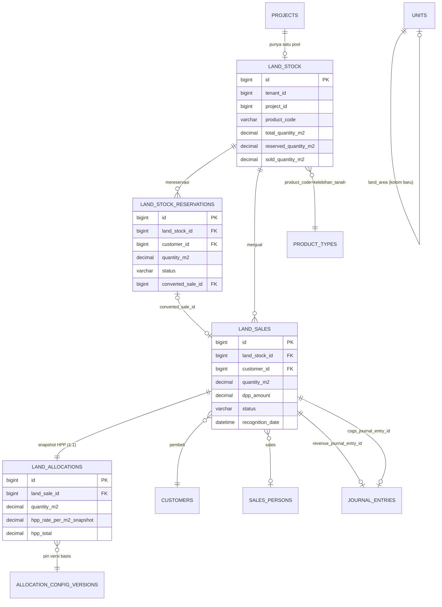

# Kelebihan Tanah — Final Target Architecture & Implementation Plan

**Tanggal:** 2026-08-21
**Status:** SHIPPED — lihat §N (2026-08-22) untuk status implementasi final. Isi di bawah §N tetap dokumen desain asli (historical), dipertahankan apa adanya untuk jejak keputusan.
**Basis keputusan:** `docs/final-business-architecture-validation-2026-08.md` R-1 (LOCKED 2026-08-06), instruksi owner sesi ini (2026-08-21).
**Metode:** Seluruh klaim "EXISTING FACT" di bawah dibaca langsung dari kode/skema/data live (`docker exec developerfiskaly-mysql-1 mysql ...`, `SHOW CREATE TABLE`, `SELECT`, pembacaan file Go langsung) pada 2026-08-20/21. Tidak ada asumsi yang tidak ditandai.

Setiap sub-bagian ditandai:
- 🔒 **LOCKED REQUIREMENT** — keputusan owner/dokumen, tidak didesain ulang di sini.
- ✅ **EXISTING FACT** — terbukti dari kode/skema/data saat ini.
- 🆕 **PROPOSED DESIGN** — usulan teknis baru pada dokumen ini.
- ❓ **OPEN BUSINESS DECISION** — genuinely belum pernah diputuskan siapa pun, perlu jawaban sebelum increment terkait dieksekusi (bukan pertanyaan ulang atas R-1).

---

## A. Architecture final yang mengikuti R-1

🔒 **R-1 (2026-08-06, LOCKED, dipakai sebagai dasar tanpa didesain ulang):**
- Kelebihan Tanah punya HPP dari **nilai tanah saja** (`CostCategoryLand`), tidak menyerap Hard/Soft/Financing.
- `ProductCategory` bertambah nilai baru: `land`.
- Kelebihan Tanah **bukan** `ChargeGroup kind=addon`.
- Engine alokasi yang ada **diperluas** (bobot per cost pool), bukan dibuat ulang.

✅ **EXISTING FACT — kondisi kode hari ini yang jadi titik tolak:**
- `domain.ProductCategory` hanya punya 2 nilai: `property`, `non_property` (`internal/domain/product_category.go:25-27`). Fungsi kanonik `ParticipatesInHPP()` (baris 49-51) mengembalikan `true` hanya untuk `property`.
- `internal/allocation/engine.go` `Compute()`/`buildWeights()` (baris 17-94): menerima **satu** `[]UnitInput` dan **satu** `basis`, lalu mengalokasikan Land/Hard/Soft/Financing dengan **vektor bobot yang sama persis**. Tidak ada per-pool weighting sama sekali hari ini.
- `internal/allocation/repository.go` `GetUnitInputs` (baris 167-200): sumber `UnitInput` **hanya** tabel `units` (JOIN `product_types` by `unit_type`), difilter oleh `ParticipatesInHPP()`. Tidak ada sumber lain.
- `allocation_config_versions.basis` (skema live): `ENUM`-like `'saleable_area' | 'sales_value'` — hanya dua nilai, satu basis per project-version, bukan per-pool.
- `allocation_snapshots` (skema live): `UNIQUE KEY uk_alloc_snap_unit (tenant_id, unit_id)` — struktural satu snapshot per **unit**, dan `unit_id` **wajib** merujuk baris `units`.
- `sale_contracts.unit_id` — `bigint unsigned NOT NULL` (skema live, tidak nullable, tidak ada alternatif kolom). `charge_groups.sale_contract_id` dan `charge_groups.unit_id` juga `NOT NULL`, dengan `CHECK kind IN ('realization','addon')`.
- **Audit data live (2026-08-21, diperbarui):** hanya **2 baris** `charge_groups` berkategori `kind='addon'` di seluruh sistem (id 11 tenant 9900245, id 547 tenant 9900246). Keduanya `status='open'`, item-itemnya (`charge_items` id 19, 848, 849) semua `recognized_amount=0`, `recognized_at=NULL` — **belum ada pengakuan pendapatan/invoice**. Tapi grup 11 **punya jurnal titipan yang sudah posted** (Rp1.000.000, transfer internal dari grup lain — lihat §G.1 untuk detail lengkap dan revisi kesimpulan). Grup 547 murni bersih, nol jejak keuangan.

🆕 **PROPOSED DESIGN — perubahan struktural minimum:**

1. `ProductCategory` bertambah `land`. Fungsi kanonik direstrukturisasi dari `ParticipatesInHPP() bool` menjadi `ParticipatesInCostPool(pool domain.CostCategory) bool`:

   | Kategori | Land | Hard | Soft | Financing |
   |---|---|---|---|---|
   | `property` | ✅ | ✅ | ✅ | ✅ |
   | `land` | ✅ | ❌ | ❌ | ❌ |
   | `non_property` | ❌ | ❌ | ❌ | ❌ |

   `ParticipatesInHPP()` dipertahankan sebagai turunan (`category == property || category == land`) supaya pembaca lama (mis. progress fisik, yang **tetap** hanya `property` — Kelebihan Tanah tidak membangun apa pun) tidak perlu tahu detail pool.

2. Engine alokasi **tidak diganti**, hanya `buildWeights` dipanggil **sekali per pool** dengan himpunan peserta yang berbeda per pool, bukan satu himpunan untuk semuanya. Detail di §E.

3. Kelebihan Tanah **tidak lagi dimodelkan sebagai baris `units`** (sesuai keluhan awal — itulah akar bug kartu unit palsu di `/penjualan`) **dan tidak lagi lewat `charge_groups`/`sale_contracts.unit_id`** (per R-1/TD-5 + instruksi eksplisit: jangan dipaksakan ke `sale_contracts.unit_id`). Ia mendapat rangkaian tabel sendiri — didesain di §B — yang menjadi peserta **baru** di pool Tanah tanpa pernah menjadi baris `units`.

---

## B. Domain model final — standalone Kelebihan Tanah

🆕 **PROPOSED DESIGN.** Lima tabel baru, semuanya mengikuti aturan wajib CLAUDE.md (`id BIGINT UNSIGNED AUTO_INCREMENT`, `tenant_id BIGINT UNSIGNED NOT NULL` + index, `created_at`/`updated_at DATETIME(3)`, tenant isolation via GORM global scope). Ditulis sebagai deskripsi kolom, **bukan** DDL final — migrasi ditulis pada increment terpisah, bukan di sini.

### B.1 `land_stock` — pool inventory per proyek

| Kolom | Tipe | Catatan |
|---|---|---|
| `id` | PK | |
| `tenant_id`, `project_id` | FK | `UNIQUE(tenant_id, project_id)` — **satu pool per proyek** (Q2, §L Q2) |
| `product_code` | varchar | selalu `'kelebihan_tanah'` hari ini; disiapkan generik untuk produk tanah lain di masa depan |
| `total_quantity_m2` | DECIMAL(20,4) | **input manual admin**, tidak ada validasi silang ke `projects.land_area` (Q2 — field itu terbukti tidak reliable: project 1739 `land_area=100` vs `Σunits.saleable_area=1924`, 19x selisih) |
| `reserved_quantity_m2` | DECIMAL(20,4) | counter, diubah transaksional saat reservasi dibuat/dibatalkan |
| `sold_quantity_m2` | DECIMAL(20,4) | counter, diubah transaksional saat Akad/pembatalan pasca-Akad |
| `unit_price` | DECIMAL(20,4) | harga jual per m² saat ini (dipakai sbg default saat reservasi baru, bukan sumber kebenaran transaksi — tiap transaksi snapshot harganya sendiri, lihat B.3) |
| `created_at`, `updated_at` | | |

`available_quantity_m2` **tidak disimpan** — selalu dihitung `total - reserved - sold` saat dibaca, supaya tidak ada dua sumber kebenaran untuk angka yang sama (prinsip SSOT, dipegang di seluruh dokumen freeze).

### B.2 `land_stock_reservations` — booking-equivalent

| Kolom | Tipe | Catatan |
|---|---|---|
| `id`, `tenant_id` | | |
| `land_stock_id` | FK → `land_stock` | |
| `project_id` | FK, denormalized dari `land_stock_id` (pola sama dengan `bookings.project_id` yang juga denormalized dari `unit_id`) |
| `customer_id`, `sales_person_id` | FK | mengikuti pola `bookings` (customer wajib, sales optional/atribusi) |
| `quantity_m2` | DECIMAL(20,4) | |
| `unit_price_snapshot` | DECIMAL(20,4) | harga dibekukan saat reservasi dibuat |
| `reserved_at`, `expiry_date` | | |
| `status` | varchar CHECK | `active｜converted｜expired｜cancelled` — persis pola `bookings.status` CHECK |
| `converted_sale_id` | FK → `land_sales`, nullable | |

❓ **OPEN BUSINESS DECISION (bukan bagian R-1, genuinely belum pernah dijawab):** apakah reservasi Kelebihan Tanah **memerlukan booking fee** seperti reservasi unit rumah (`bookings.booking_fee`, `fee_disposition`)? Tidak ada satu pun dokumen atau kode yang menyinggung ini. Rekomendasi v1 (tidak mengikat, hanya usulan): **tanpa fee** — reservasi murni penguncian kuantitas sementara (mis. TTL pendek), karena nilai Kelebihan Tanah biasanya jauh lebih kecil dari unit rumah dan menambah kompleksitas fee-disposition di sini tidak dituntut requirement mana pun. Owner perlu mengonfirmasi ini secara eksplisit sebelum LT-3 (§M).

### B.3 `land_sales` — Akad-equivalent, transaksi berdiri sendiri

Ini **menggantikan** penggunaan `sale_contracts.unit_id`/`charge_groups`, sesuai instruksi eksplisit: *"jangan memaksa Kelebihan Tanah masuk ke `sale_contracts.unit_id`"*. Bentuknya sengaja meniru `sale_contracts` (kolom PPN, snapshot harga) supaya mesin pajak/PPN yang sudah generik bisa dipakai ulang tanpa modifikasi.

| Kolom | Tipe | Catatan |
|---|---|---|
| `id`, `tenant_id`, `project_id` | | |
| `land_stock_id` | FK → `land_stock` | |
| `reservation_id` | FK → `land_stock_reservations`, nullable | null bila dijual langsung tanpa reservasi lebih dulu |
| `customer_id`, `sales_person_id` | FK | |
| `quantity_m2` | DECIMAL(20,4) | |
| `unit_price_snapshot`, `dpp_amount`, `is_pkp`, `vat_rate_snapshot`, `gross_amount` | | **struktur identik** `sale_contracts` (baris 12-20 skema live) — reuse pola PPN yang sudah ada, tidak menciptakan mesin pajak kedua |
| `recognition_date` | datetime | analog `Akad` — titik pengakuan revenue+HPP |
| `status` | varchar CHECK | `draft｜akad｜cancelled` |
| `revenue_journal_entry_id`, `cogs_journal_entry_id` | FK → `journal_entries`, nullable | pola sama `sale_records` yang menyimpan referensi jurnal Event 3/4 |
| `created_at`, `updated_at` | | |

❓ **OPEN BUSINESS DECISION:** apakah `land_sales` perlu skema pembayaran cicilan/KPR seperti unit (`payment_scheme_id`, `scheme_state`)? Tidak ada requirement yang menyebutkan ini — semua contoh owner (termasuk contoh awal "dua sales rebutan stok tanah") mengasumsikan transaksi tunai/lunas. Rekomendasi v1: **tunai/lunas saja** (skema state machine dilewati, `recognition_date` diisi manual saat admin mencatat Akad) — payment scheme bisa ditambah kemudian tanpa mengubah `land_stock`/`land_allocations` sama sekali (isolated ke `land_sales`). Perlu konfirmasi eksplisit owner sebelum LT-4.

### B.4 `land_allocations` — snapshot HPP, satu per transaksi

Analog `allocation_snapshots`, tapi keyed ke `land_sale_id` (bukan `unit_id`) karena Kelebihan Tanah bukan `units`. `UNIQUE(tenant_id, land_sale_id)` — **satu snapshot per transaksi**, immutable setelah dibuat (R-2: "snapshot yang sudah beku tidak pernah dihitung ulang").

| Kolom | Tipe | Catatan |
|---|---|---|
| `id`, `tenant_id`, `project_id` | | |
| `land_sale_id` | FK, `UNIQUE(tenant_id, land_sale_id)` | |
| `land_stock_id` | FK | |
| `quantity_m2` | DECIMAL(20,4) | duplikasi dari `land_sales.quantity_m2` saat snapshot dibuat (immutable meski `land_sales` baris induk secara teori bisa — tapi tidak akan — diubah) |
| `hpp_rate_per_m2_snapshot` | DECIMAL(20,4) | tarif per-m² yang dipakai (lihat §E) |
| `hpp_total` | DECIMAL(20,4) | `quantity_m2 × hpp_rate_per_m2_snapshot`, dibulatkan sesuai aturan Money |
| `basis` | varchar | `'land_area'` — nilai baru untuk kolom sejenis `allocation_config_versions.basis` |
| `allocation_config_version_id`, `allocation_config_version` | FK, int | pola identik `allocation_snapshots` — pin versi basis yang dipakai |
| `budget_plan_id`, `budget_plan_version` | FK, int | pola identik `allocation_snapshots` |
| `created_at` | | append-only, tidak pernah di-UPDATE (kolom `updated_at` tetap ada mengikuti aturan wajib tabel, tapi secara desain tidak pernah tersentuh) |

### B.5 `units.land_area` — kolom baru, TERPISAH dari `saleable_area`

🔒 Mengikuti keputusan eksplisit: **jangan menebak** arti `saleable_area`. Gunakan desain yang sudah pernah dirancang di `docs/uat-fe-proyek-tab-unit-audit-2026-08.md` (migrasi yang diusulkan tapi tak pernah dieksekusi, `000062_unit_area_split`), diperluas seperlunya:

- `units.land_area DECIMAL(20,4) NOT NULL DEFAULT '0.0000'` — kolom baru, **tidak backfill otomatis** dari `saleable_area` atau `projects.land_area` (keduanya terbukti tidak reliable/tidak berarti sama).
- `saleable_area` **tidak disentuh sama sekali** — tetap basis pool Hard/Soft/Financing seperti sekarang (R-1: "Pool Konstruksi hanya berisi produk property, basisnya boleh tetap seperti sekarang").
- Pengisian `land_area` per unit properti **eksplisit oleh admin** pada data proyek yang benar (form edit unit), bukan backfill massal berbasis asumsi.
- Sebelum `land_area` diisi admin untuk sebuah unit (`= 0` default), unit itu punya bobot **nol** di pool Tanah — bukan error, bukan exclude diam-diam dari HPP-nya sendiri (unit tetap dapat porsi Hard/Soft/Financing seperti biasa dari `saleable_area`), hanya porsi **Tanah**-nya nol sampai admin mengisi `land_area`. Ini fail-safe, bukan fail-closed keras, karena unit yang sudah lama ada tidak boleh tiba-tiba gagal BAST hanya karena kolom baru kosong — 🆕 catatan desain, lihat juga J.4.

---

## C. ERD



*(Diagram khusus tabel baru — tidak menggambar ulang skema `units`/`sale_contracts`/`charge_groups` yang sudah ada dan tidak berubah, kecuali penambahan satu kolom `units.land_area`.)*

---

## D. Lifecycle lengkap

```
AVAILABLE (land_stock.total − reserved − sold)
    │
    │  admin/sales buat reservasi (row-lock land_stock)
    ▼
RESERVED (land_stock_reservations.status='active', reserved += qty)
    │
    ├── expired/dibatalkan ──────────────► reserved -= qty, kembali AVAILABLE
    │                                       (land_stock_reservations.status
    │                                        = expired|cancelled)
    │
    ▼ dikonversi ke penjualan
land_sales dibuat (status='draft' atau langsung 'akad')
    │
    ▼ Akad dicatat (admin input harga final + tanggal)
SOLD  (reserved -= qty, sold += qty)
    │  ATOMIK dalam satu transaksi:
    │  - land_sales.status → 'akad', recognition_date terisi
    │  - Revenue journal (Dr Piutang/Kas, Cr akun pendapatan tanah)
    │  - HPP journal (Dr 5-1000, Cr 1-3000) — dari land_allocations
    │  - land_allocations dibuat (snapshot, immutable, §B.4)
    │
    ▼ (opsional, kapan saja setelahnya — tanpa gate finansial, konsisten
    │  dengan pola MarkPhysicalHandover unit properti/Temuan #7)
    "Serah terima tanah" — non-finansial, tidak wajib untuk desain v1
    │
    ▼ pembatalan pasca-Akad (jarang, lihat §F.3)
CANCELLED: jurnal pembalik (revenue + HPP), sold -= qty, qty kembali
    ke AVAILABLE (bukan reserved — pembeli sudah batal total)
```

✅ **EXISTING FACT yang jadi pola rujukan:** unit properti hari ini punya lifecycle `available → booked/reserved → sold → occupied` dengan gate finansial HANYA di titik Akad (`internal/sale/repository.go:202-331` `Execute()`, satu `gorm.DB.Transaction`), dan serah terima fisik terpisah tanpa jurnal (`MarkPhysicalHandover`, `internal/sale/repository.go:389-457`). Lifecycle Kelebihan Tanah di atas sengaja **meniru pola yang sama** (gate finansial hanya di Akad, serah terima kalau ada terpisah tanpa jurnal) — bukan pola baru.

---

## E. HPP Land — integrasi dengan allocation engine existing

Ini bagian paling struktural. 🔒 **LOCKED**: satu engine (`Money.Allocate`, largest-remainder), bukan engine kedua.

### E.1 Perubahan minimum pada `allocation` package

🆕 **PROPOSED DESIGN:**

1. `Compute()` dipanggil **terpisah per pool**, bukan sekali untuk keempat kategori. Untuk Hard/Soft/Financing: dipanggil **persis seperti sekarang** dengan peserta = unit `property` saja, basis `saleable_area` — **tidak berubah** (R-1: pool ini tidak boleh terdilusi Kelebihan Tanah).
2. Untuk pool **Land**: `Compute()` dipanggil dengan peserta gabungan:
   - Semua unit `property` di proyek, bobot = `units.land_area` (kolom baru §B.5) — **bukan** `saleable_area`.
   - **Satu** peserta tambahan mewakili seluruh pool `land_stock` proyek itu, bobot = `land_stock.total_quantity_m2` (seluruh stok, bukan hanya yang sudah terjual — meniru cara property: SEMUA unit ikut pembagian pool meski belum terjual, supaya persentase tiap peserta stabil tidak tergantung urutan penjualan).
   - Hasil `Compute()` untuk peserta "land_stock" ini adalah **satu angka total** (bagian pool Tanah yang jadi hak seluruh stok Kelebihan Tanah), **bukan** langsung HPP per transaksi individual.
3. Angka total itu dibagi lagi jadi **tarif per m²**: `hpp_rate_per_m2 = land_stock_total_HPP / land_stock.total_quantity_m2`. Tarif inilah yang di-resolve oleh `land_sales` masing-masing saat Akad-nya sendiri (`hpp_rate_per_m2_snapshot` di `land_allocations`, §B.4) — dua level, persis seperti pool → unit sekarang, ditambah satu level lagi unit-pool-tanah → transaksi-individual, karena `land_sales` sifatnya berkelanjutan (event yang terjadi kapan saja), bukan daftar tetap yang diketahui di muka seperti daftar unit.

### E.2 Perluasan `GetUnitInputs` → `GetAllocationParticipants`

🆕 Fungsi baru menggabungkan dua sumber:
```
property units (dari `units`, sama seperti GetUnitInputs sekarang, weight = land_area untuk pool Land, saleable_area untuk pool lain)
  UNION
satu baris "land pool" per project_id yang punya land_stock (weight = land_stock.total_quantity_m2, HANYA berpartisipasi di pool Land)
```
`ParticipatesInCostPool(pool)` (§A) yang memutuskan siapa masuk himpunan mana — SQL di repository tetap "bodoh" (tidak menafsirkan aturan), persis pola `H-1` yang sudah ada sekarang.

### E.3 Rounding lintas transaksi — masalah baru yang belum pernah muncul

⚠️ **Temuan struktural penting, bukan permintaan asli owner, tapi harus ditandai:** `Money.Allocate(weights)` menjamin `Σ(parts) == original` untuk **satu himpunan tetap** yang diketahui sekaligus. Tapi `land_sales` terjadi **berturut-turut sepanjang waktu** (bukan daftar tetap seperti unit) — setiap transaksi memakai `hpp_rate_per_m2` yang sama, dikalikan `quantity_m2`-nya sendiri, dan pembulatan per transaksi (`quantity × rate`, bukan `Money.Allocate`) **tidak otomatis** menjamin `Σ(semua land_sales.hpp_total) == total HPP pool Tanah yang jadi hak land_stock` sampai rupiah terakhir — beda karakter dari alokasi antar-unit yang statis.

✅ **KOREKSI EXISTING FACT (2026-08-21, ralat dari draf sebelumnya):** draf pertama dokumen ini menyebut `hpp_trueup_runs`/`hpp_trueup_lines` sebagai skema "dormant, TD-6, belum pernah punya kode konsumen" dan mengusulkannya sebagai mekanisme rekonsiliasi. **Ini keliru** — dibuktikan langsung dari kode: `internal/closing/service.go` (668 baris) mengimplementasikan penuh siklus `MarkCompleted → FinalizeCompletion → Calculate → Approve → Post` (P0-4, SUDAH SHIPPED). Fakta persisnya:
- True-up hanya bisa dijalankan setelah **proyek/fase mencapai status `completed→finalized`** (`FinalizeCompletion`, baris 82-103) — ini proses **satu kali di akhir konstruksi**, bukan mekanisme berkala/kontinu.
- `hpp_trueup_lines.unit_id BIGINT UNSIGNED NOT NULL` — FK wajib ke `units`, pola yang **sama persis** dengan `sale_contracts.unit_id`/`termin_payments.unit_id` yang sudah terbukti jadi penghalang standalone product di bagian lain dokumen ini. `land_stock` **tidak bisa** ditulis ke sana tanpa perubahan skema (`unit_id` jadi nullable + kolom `land_stock_id` baru).
- `Post()` memposting **satu jurnal penyesuaian per run**, immutable (`journal_id UNIQUE`) — sudah benar soal invariant #5, tapi menegaskan sifatnya: satu peristiwa closing per proyek, bukan penyeimbang yang jalan tiap kali ada `land_sale` baru.

🆕 **PROPOSED DESIGN (revisi):** true-up **TIDAK dipakai untuk Land di v1**. Alasan: kebutuhan sebenarnya simetris dengan unit properti — `land_stock` sebagai satu peserta pool berperilaku identik dengan satu unit properti: `AllocationSnapshot`-nya (baca: `land_allocations`) dibekukan di titik waktu resolusinya (finalized→budgeted→actual, sama seperti unit), dan **selisih terhadap biaya final proyek adalah hal yang SUDAH diterima sebagai perilaku normal untuk unit properti hari ini** (itulah sebabnya true-up ada — dijalankan sekali di closing, mencakup SEMUA unit terjual). Land tidak butuh mekanisme baru untuk v1 — cukup mewarisi ketidaksempurnaan yang sama, direkonsiliasi nanti bersama unit properti pada saat closing proyek. Memperluas `hpp_trueup_lines` untuk mencakup `land_stock` (menambah kolom nullable + baris `category='land_stock'` semacamnya) adalah **peningkatan v2 yang valid**, di luar cakupan v1, dan butuh perubahan skema — tidak dikerjakan sekarang.

✅ **EXISTING FACT:** `land_stock`/`land_sales` yang belum terjual sepenuhnya (`sold_quantity_m2 < total_quantity_m2`) berarti sebagian pool Tanah "milik" Kelebihan Tanah **belum terealisasi** ke transaksi mana pun — sama seperti unit `property` yang belum Akad, porsi Tanah-nya juga belum jadi HPP siapa pun. Tidak melanggar invariant #4 (Total = Direct + Allocated) karena baris yang belum terjual memang belum mengakui HPP apa pun, persis seperti unit yang belum Akad hari ini.

### E.4 `ResolveHPP` — pola resolver yang sama, diperluas

✅ **EXISTING FACT:** `internal/sale/hpp_resolver.go` `ResolveHPP` (chain finalized → budgeted → actual) dipakai unit properti hari ini.
🆕 **PROPOSED DESIGN:** fungsi analog `ResolveLandHPPRate(ctx, tenantID, projectID)` mengembalikan `Money` per-m² memakai chain **yang sama persis** (bukan resolver kedua) — bedanya hanya angka yang di-resolve adalah tarif per-m², bukan lump-sum per unit.

---

## F. Accounting flow lengkap

### F.1 Revenue (saat Akad `land_sale`)

🔒 R-1 §1.3: akun pendapatan sendiri, usulan `4-1100 Pendapatan Penjualan Tanah` — **belum final angka pastinya**, tapi arah "akun terpisah dari rumah" sudah dikunci owner.

```
Dr  1-2000 Piutang Customer (atau Kas jika lunas tunai langsung)   gross_amount
    Cr  4-1100 Pendapatan Penjualan Tanah (usulan)                  dpp_amount
    Cr  2-1300 PPN Keluaran (jika is_pkp)                            ppn_amount
```
✅ Pola ini **identik** dengan Event 3 unit properti (`internal/sale/service.go`, `buildEvent3Lines` — nama fungsi tidak diverifikasi persis di sesi ini tapi pola Dr Piutang/Cr Pendapatan+PPN sudah dikonfirmasi berulang di seluruh audit sebelumnya) — tidak ada mekanisme baru, hanya akun tujuan yang beda.

### F.2 HPP (saat Akad `land_sale`, dalam transaksi atomik yang sama)

```
Dr  5-1000 HPP                          hpp_total (dari land_allocations)
    Cr  1-3000 Persediaan Tanah          hpp_total
```
✅ Akun **1-3000** dan **5-1000** adalah akun yang **sudah dipakai** unit properti untuk kategori `CostCategoryLand` (`InventoryAccountCode()`, `internal/domain/cost_category.go:90-91`) dan Event 4 (`internal/sale/service.go:721`). Tidak ada akun baru untuk HPP — hanya `4-1100` (revenue) yang baru.

### F.3 Pembatalan pasca-Akad

🆕 Meniru pola `StagePostBAST` (`internal/cancellation/service.go`) yang sudah ada untuk unit properti: revenue dibalik via `ledger.PostingService.Reverse()` (jurnal pembalik berantai, invariant #5), HPP dibalik via jurnal cermin manual (pola `cogsSourceLines` yang sudah ada). `land_sales.status → 'cancelled'`, `land_stock.sold_quantity_m2 -= quantity_m2`, kuantitas kembali ke AVAILABLE. Ini **bukan mekanisme baru** — perluasan `cancellation` package untuk mengenali `land_sales` sebagai sumber ketiga (setelah unit properti dan — belum ada — addon), memakai pola yang identik.

⚠️ Dicatat, bukan bagian pekerjaan sekarang: pembatalan pasca-Akad untuk **addon biasa** (`ChargeGroup`) hari ini **tidak pernah dibalik** sama sekali (`cancellation/service.go` nol referensi ke `addon`/`ChargeGroup`) — gap pre-existing, tidak diperbaiki di sini, tapi `land_sales` **tidak mewarisi gap itu** karena `land_sales` bukan `ChargeGroup`.

---

## G. Migration strategy — kompatibilitas data W-13 dan legacy unit

### G.1 Data W-13 addon Kelebihan Tanah

✅ **EXISTING FACT (diaudit langsung, live, 2026-08-21):**
```
charge_groups id=11  tenant=9900245  sale_contract_id=775  unit_id=1433
  → charge_items id=19: label "Kelebihan tanah 12 m2", amount 6.000.000,
    product_code=NULL, recognized_amount=0, recognized_at=NULL, status='open'

charge_groups id=547 tenant=9900246  sale_contract_id=2650 unit_id=2102
  → charge_items id=848,849: product_code='kelebihan_tanah', amount masing²
    5.000.000, recognized_amount=0, recognized_at=NULL, status='open'
```
Ini **satu-satunya** dua baris `kind='addon'` di seluruh database (`SELECT COUNT(*) FROM charge_groups WHERE kind='addon'` = 2). Pencarian `journal_lines`/`journal_entries` untuk kedua grup ini: **nihil**. Tidak ada jurnal yang pernah terposting untuk Kelebihan Tanah lewat jalur addon.

**Kesimpulan awal (recognized_amount=0 saja) tidak lengkap — lihat koreksi di bawah.**

✅ **KOREKSI EXISTING FACT (2026-08-21):** `recognized_amount`/`recognized_at` hanya mencerminkan status invoice/pengakuan pendapatan — **bukan** apakah ada uang/jurnal yang menyentuh grup itu. Audit lanjutan menemukan satu baris `termin_payments` (id=1449) dengan `charge_group_id=11`, amount Rp1.000.000, `journal_entry_id=2391` **terposting** (2026-08-04), dan satu baris `payment_allocations` (id=1574) yang mengalokasikan penuh Rp1.000.000 itu ke `charge_items.id=19` (item milik grup 11). Isi jurnal 2391: Dr 2-2400 Titipan Realisasi / Cr 2-2400 Titipan Realisasi (dua baris, akun yang sama, net nol ke neraca) — deskripsi "Transfer titipan realisasi grup #7 → grup #11": ini **transfer internal**, memindahkan Rp1.000.000 yang semula ada di `charge_groups.id=7` (kind=`realization`, unit 1433, status=`settled`) menjadi "milik" grup 11 (addon Kelebihan Tanah). **Grup 547 tetap bersih** — nol baris di `termin_payments`/`receipts`/`payment_allocations` mana pun.

**Konsekuensi langsung:** `CancelGroup(11)` **akan ditolak** oleh guard `ErrGroupHasMoney` (`internal/charge/service.go:359-361`, `!sum.Paid.IsZero()`) karena `paidByItemDB` membaca `payment_allocations` (bukan `recognized_amount`) dan akan mengembalikan Rp1.000.000 untuk item 19. Grup 11 **BUKAN** kasus "nol dependency, batal langsung" seperti draf pertama menyimpulkan.

🆕 **PROPOSED DESIGN (revisi, dipecah per grup):**

- **Grup 547 (bersih):** batal langsung lewat `CancelGroup` — mekanisme existing, tanpa jurnal, tanpa prasyarat lain. Tidak berubah dari draf sebelumnya.
- **Grup 11 (ada uang Rp1.000.000):** **TIDAK bisa** langsung di-`CancelGroup`. Opsi yang tersedia, murni disposisi bisnis atas Rp1jt yang sudah menempel — **bukan hal yang boleh saya putuskan sepihak di sini**:
  a. Transfer balik Rp1.000.000 ke grup 7 (kind=`realization`, `status=settled` — sudah menetap; mengembalikan seperti semula), lewat mekanisme "transfer titipan" yang sama (net nol, tidak menyentuh #5) — baru grup 11 bisa `CancelGroup`.
  b. Biarkan Rp1.000.000 tetap "menempel" di grup 11 apa adanya, dan tunda pembatalan grup ini sampai jalur `land_sales` (LT-5) siap — pada saat itu, admin membuat `land_sale` baru untuk pembeli unit 1433 dan **memindahkan** Rp1.000.000 ini menjadi DP `land_sale` tersebut (mekanisme pemindahan/pemetaan spesifik: lihat OPEN BUSINESS DECISION baru di bawah).
  c. Sesuatu yang lain yang hanya diketahui pemilik/admin yang mencatat transfer titipan #7→#11 pada 2026-08-04 (kenapa Rp1jt itu dipindah ke sana — konteks bisnisnya tidak terlihat dari data).

  ❓ **OPEN BUSINESS DECISION (baru, genuinely belum pernah diputuskan):** disposisi Rp1.000.000 pada charge_group 11 (unit 1433, tenant 9900245) — dikembalikan ke grup 7, dipindahkan jadi DP land_sale masa depan, atau ditangani lain. **Tidak dijawab di sini** — ini transaksi nyata dengan uang nyata, bukan detail mekanisme yang aman ditebak. Grup 11 **tetap terbuka apa adanya** sampai owner memutuskan; tidak ada tindakan otomatis terhadapnya di LT manapun.

1. Setelah dibatalkan/diselesaikan, admin **mencatat ulang** transaksi setara (jika masih relevan secara bisnis) lewat jalur `land_sales` yang baru, dengan kuantitas m² yang benar (data lama tidak punya kuantitas sama sekali — `product_code=NULL` di grup 11, tidak ada kolom m² apa pun di `charge_items` — jadi tidak bisa diotomasi, harus re-entry manual oleh admin yang tahu kontraknya).
2. **Bekukan (freeze), jangan hapus** jalur addon Kelebihan Tanah: hentikan `kelebihan_tanah` dari daftar produk yang ditawarkan `ContractForm.tsx`'s addon selector, dan/atau tolak secara fail-closed di `resolveAddonProduct` (`internal/charge/addon.go`) untuk kategori `land` begitu kategori itu ada — **bukan menghapus kode addon** (masih dipakai produk non-property lain yang sah, mis. PDAM jika masih aktif — meski per R-1 juga akan dinonaktifkan terpisah, itu keputusan lain, di luar cakupan sini).

### G.2 `product_types.kelebihan_tanah.revenue_account_code`

✅ **EXISTING FACT:** 25 baris (satu per tenant, seed standar) semuanya `revenue_account_code='4-2000'` — akun revenue generik yang sama dipakai produk addon lain. Karena tidak ada jurnal historis yang menaruh jejak di akun ini untuk Kelebihan Tanah (§G.1), **aman diubah** ke `4-1100` (atau akun final yang disepakati) tanpa menyentuh ledger — ini murni update master data, bukan koreksi jurnal.

🆕 Sekalian: `category` produk ini diubah `non_property → land` begitu nilai kategori baru itu ada di domain (§A).

### G.3 Unit legacy 1714 & 5931

🔒 Sudah dikunci (Q5, tidak berubah): **1714 tidak disentuh sama sekali** (punya histori posted: `bookings` id 497, `journal_lines` journal_entry_id 6997 Dr 1-1300/Cr 4-2100 Rp1.000 posted, `receipts` KWB/2026/000002, `termin_payments` id 3332, `unit_status_transitions` 2 baris). **5931 dikeluarkan dari read path** (`ListUnitsByProject`/`ListUnitsByPhase`, dipakai `/penjualan`), nol referensi di 20 tabel yang diperiksa — filter murni, bukan migrasi data.

🆕 **Hotfix terpisah, independen dari seluruh redesign di atas** — lihat §M, ditandai boleh jalan lebih dulu.

---

## H. API / backend changes (desain, belum kode)

| Paket/berkas | Perubahan | Alasan |
|---|---|---|
| `internal/domain/product_category.go` | tambah `ProductCategoryLand`, ganti `ParticipatesInHPP()` jadi turunan dari `ParticipatesInCostPool(pool)` baru | §A |
| `internal/domain/cost_category.go` | tidak berubah — `CostCategoryLand` sudah ada, dipakai apa adanya | §A, §E |
| `internal/allocation/engine.go` | `Compute`/`buildWeights` dipanggil per pool dengan himpunan peserta berbeda | §E.1 |
| `internal/allocation/repository.go` | `GetUnitInputs` → tambah `GetAllocationParticipants` (union unit properti + satu baris land-pool) | §E.2 |
| `internal/allocation/model.go` (atau sejenis, belum dibaca detail sesi ini — perlu dikonfirmasi nama file persis saat implementasi) | `UnitInput` diperluas jadi struct yang membawa bobot per pool | §E.1 |
| **`internal/land` (paket baru)** | model `LandStock`, `LandStockReservation`, `LandSale`, `LandAllocation`; repository; service (reserve/convert/akad/cancel) | §B, mengikuti konvensi `internal/*/repository.go`, `internal/*/service.go`, `internal/*/handler.go` di CLAUDE.md |
| `internal/sale/hpp_resolver.go` | tambah `ResolveLandHPPRate` memakai chain resolver yang sama | §E.4 |
| `internal/cancellation/service.go` | tambah pengenalan `land_sales` sebagai sumber pembatalan ketiga, reuse pola `StagePostBAST` | §F.3 |
| `internal/charge/addon.go` | `resolveAddonProduct` menolak kategori `land` (fail-closed) begitu kategori itu ada | §G.1 |
| `internal/project/service.go` `ListUnitsByProject`/`ListUnitsByPhase` (dipakai `/penjualan`) | filter `unit_type` non-properti dari hasil, ATAU biarkan endpoint ini apa adanya dan filter di frontend — **keputusan implementasi**, bukan blocking desain | §G.3, hotfix terpisah |
| `internal/ledger` | tidak berubah — akun `4-1100` (baru, hanya baris master `chart_of_accounts`, bukan kode) ditambahkan sebagai data seed, bukan logic | §F.1 |

---

## I. Frontend flow

🆕 **PROPOSED DESIGN** (deskriptif, bukan implementasi):

1. **Halaman/section baru** "Kelebihan Tanah" di dalam detail proyek — menampilkan **total/reserved/sold/available m²** persis mockup numerik awal Anda. Bukan bagian dari `UnitDirectory`/`/penjualan` — section terpisah, konsisten dengan "tidak pernah muncul sebagai kartu unit sendiri".
2. **Modal reservasi** — input kuantitas m², bukan pilih unit dari daftar (beda dari `BookingFormModal.tsx` yang berbasis pilih 1 unit).
3. **Form Akad Kelebihan Tanah** — analog `AkadForm.tsx`, tapi terhubung ke `land_sales`, bukan `units`.
4. **Perubahan pada komponen existing:**
   - `UnitDirectory.tsx` (`/penjualan`) — tidak lagi menerima baris Kelebihan Tanah sama sekali (§G.3 hotfix, sudah cukup dari sisi backend filter, tapi FE juga aman didefensifkan).
   - `ContractForm.tsx` — hapus `kelebihan_tanah` dari daftar produk addon yang bisa dipilih (§G.1 freeze).

---

## J. Concurrency / invariant rules

🆕 **PROPOSED DESIGN**, mengikuti pola yang **sudah terbukti** dipakai konsisten (booking, installment, buyer-credit, AP, cancellation — semua pakai `SELECT ... FOR UPDATE` / `clause.Locking{Strength:"UPDATE"}`):

1. **INV-LAND-1**: `land_stock.reserved_quantity_m2 + land_stock.sold_quantity_m2 ≤ land_stock.total_quantity_m2`, selalu. Ditegakkan di dalam transaksi yang me-row-lock baris `land_stock` sebelum increment apa pun (mencegah race dua sales reservasi kuantitas yang sama — persis skenario contoh awal Anda).
2. **INV-LAND-2**: `Σ(land_sales.quantity_m2 WHERE status != 'cancelled') == land_stock.sold_quantity_m2`, per proyek — invariant rekonsiliasi, diuji seperti `INV-COGS-SUM` yang sudah ada untuk unit properti.
3. **INV-LAND-3**: `Σ(land_allocations.hpp_total, seluruh land_sales proyek) ≤ bagian pool Land yang jadi hak land_stock` — direkonsiliasi lewat mekanisme true-up (§E.3), bukan per-transaksi.
4. Unit properti dengan `land_area = 0` (belum diisi admin, §B.5) **tidak gagal** Akad-nya sendiri — hanya mendapat porsi Tanah nol, bukan error fail-closed keras (beda dari `ErrUnitTypeUnregistered` yang memang harus keras karena representasi kategori tidak dikenal sama sekali; `land_area=0` adalah nilai sah, bukan data rusak).
5. Tenant isolation — kelima tabel baru wajib `tenant_id` + GORM global scope, diuji integration test lintas-tenant (invariant #6 CLAUDE.md).

---

## K. Test matrix

| Area | Kasus |
|---|---|
| **Lifecycle** | reserve → convert → Akad; reserve → expire → available lagi; reserve dua kali melebihi stok (harus ditolak); Akad langsung tanpa reservasi |
| **HPP integrasi** | pool Land terbagi benar antara unit properti (`land_area`) dan land_stock (`total_quantity_m2`); Σ seluruh peserta pool Land == biaya tanah proyek, persis (invariant #3); pool Hard/Soft/Financing **tidak berubah** sama sekali dibanding sebelum ada Kelebihan Tanah (regression test eksplisit) |
| **Rounding lintas transaksi** | beberapa `land_sales` berurutan terhadap `land_stock` yang sama — total HPP mereka + true-up == total yang dialokasikan ke land_stock, sampai rupiah terakhir |
| **Concurrency** | dua reservasi paralel terhadap sisa kuantitas yang sama — hanya satu yang boleh berhasil bila total melebihi available |
| **Cancellation** | pembatalan pasca-Akad `land_sales`: jurnal pembalik benar (Σdebit==Σkredit), `sold_quantity_m2` berkurang, kuantitas kembali available |
| **Legacy/migration** | unit 1714 tidak berubah sama sekali setelah semua perubahan (snapshot before/after identik); unit 5931 tidak muncul di `/penjualan`; dua `charge_groups` addon lama berhasil `CancelGroup` tanpa membuat jurnal apa pun |
| **Tenant isolation** | query lintas-tenant terhadap kelima tabel baru mengembalikan nol hasil |
| **`land_area=0`** | unit properti dengan `land_area` belum diisi tetap bisa Akad, porsi Tanah-nya nol, porsi Hard/Soft/Financing normal |

---

## L. Daftar file existing yang harus diubah

*(Ringkasan dari §H, dengan alasan eksplisit per file — tidak diulang detail teknisnya.)*

| File | Alasan |
|---|---|
| `internal/domain/product_category.go` | tambah kategori `land`, restrukturisasi fungsi kanonik partisipasi pool |
| `internal/allocation/engine.go` | `Compute`/`buildWeights` per-pool, bukan satu vektor untuk semua |
| `internal/allocation/repository.go` | sumber peserta alokasi diperluas dari sekadar `units` |
| `internal/sale/hpp_resolver.go` | tambah resolver tarif per-m² untuk Land, reuse chain yang sama |
| `internal/cancellation/service.go` | kenali `land_sales` sebagai sumber pembatalan, reuse pola `StagePostBAST` |
| `internal/charge/addon.go` | tolak kategori `land` dari jalur addon (freeze W-13 untuk Kelebihan Tanah) |
| `internal/project/service.go` | filter unit non-properti dari `ListUnitsByProject`/`ListUnitsByPhase` (hotfix §G.3, bisa berdiri sendiri) |
| `frontend/components/penjualan/UnitDirectory.tsx`, `ContractForm.tsx` | hilangkan Kelebihan Tanah dari alur unit & addon |
| **(baru)** `internal/land/*.go` | domain model + service + repository + handler standalone Kelebihan Tanah |
| `termin_payments`, `receipts` (skema, migrasi terpisah) | `unit_id` jadi nullable + kolom baru `land_sale_id` nullable — lihat temuan struktural pada review sign-off (dokumen terpisah) | pintu pembayaran tunggal (`ReceivePayment`, "+Catat Penerimaan") dan kwitansi hari ini **hard-anchored** ke `unit_id NOT NULL` end-to-end; tanpa perubahan ini, `land_sales` tidak bisa lewat jalur yang sama |
| `internal/sale/collection.go` `ReceivePayment`/`ReceivePaymentRequest` | tambah cabang resolusi anchor baru: `req.LandSaleID != nil` (paralel dengan `req.UnitID`/`req.ContractID`/`req.ScheduleID` yang sudah ada) | sama seperti di atas — minimum perubahan mengikuti pola anchor yang sudah ada, bukan payment engine kedua |

---

## M. Urutan implementasi paling aman (increment plan)

Prefiks `LT-` (Land Tanah) dipakai supaya tidak bentrok dengan penomoran increment lain yang sudah ada (`W-`, `R-`, `D-`, `T-`, `K-`).

| Increment | Isi | Prasyarat | Risiko |
|---|---|---|---|
| **LT-0 (hotfix, bisa jalan sendiri, prioritas tertinggi)** | Filter unit non-properti dari `/penjualan` (§G.3) — memperbaiki bug kartu palsu SEKARANG, tanpa menyentuh 1714, tanpa menunggu desain besar selesai | — | Sangat rendah — read-path only, tidak ada perubahan data |
| **LT-1** | `ProductCategory.land` + `ParticipatesInCostPool(pool)` (§A) — murni perubahan domain, belum ada peserta baru yang memakainya | — | Rendah — additive, tidak ada pemanggil lama yang berubah perilaku (property tetap `true` di semua pool seperti sebelumnya) |
| **LT-2** | `units.land_area` (kolom baru, default 0, §B.5) + form input di FE | LT-1 | Rendah — additive, tidak backfill, unit lama otomatis bobot Tanah=0 sampai diisi |
| **LT-3** | `land_stock` + CRUD admin (input `total_quantity_m2` manual) | LT-1 | Rendah — tabel baru murni, tidak ada pembaca lain bergantung |
| **LT-4** | `land_stock_reservations` + lifecycle reserve/expire/cancel + row-locking (§J) | LT-3, jawab OPEN DECISION booking fee (§B.2) | Sedang — concurrency baru, wajib test dua-reservasi-race |
| **LT-5** | `land_sales` + `land_allocations` + integrasi `GetAllocationParticipants`/`Compute` per-pool (§E) + posting Event 3/4 Land (§F.1-F.2) | LT-2, LT-3, LT-4, jawab OPEN DECISION skema pembayaran (§B.3) | **Tinggi** — menyentuh engine alokasi & ledger; wajib regression penuh pool Hard/Soft/Financing tidak berubah untuk unit properti manapun |
| **LT-6** | Pembatalan pasca-Akad `land_sales` (§F.3) | LT-5 | Sedang — reuse pola existing, tapi kombinasi state baru wajib diuji |
| **LT-7** | True-up rounding lintas transaksi (§E.3, aktifkan `hpp_trueup_runs/lines`) | LT-5, beberapa `land_sales` nyata sudah berjalan | Sedang — mekanisme lama yang belum pernah dipakai, perlu diuji end-to-end pertama kalinya |
| **LT-8** | Freeze jalur addon Kelebihan Tanah (§G.1) — batalkan grup 547 (bersih), selesaikan disposisi grup 11 (perlu keputusan owner, §G.1), tolak kategori `land` di `resolveAddonProduct`, hapus dari `ContractForm.tsx` | LT-5 (supaya ada jalur pengganti sebelum jalur lama ditutup) | Rendah untuk grup 547; **grup 11 diblokir sampai owner menjawab OPEN BUSINESS DECISION disposisi Rp1jt** (§G.1) — jangan otomatis mengeksekusi opsi apa pun terhadapnya |

**Urutan yang tidak boleh dibalik:** LT-5 sebelum LT-8 (jangan tutup jalur lama sebelum jalur baru siap dipakai admin re-entry). LT-1 sebelum semuanya (fondasi kategori). LT-0 independen, boleh kapan saja termasuk sebelum semua yang lain.

Setiap increment ditutup `go test ./...` hijau sebelum lanjut, mengikuti aturan CLAUDE.md.

---

## Ringkasan OPEN BUSINESS DECISION (hanya yang genuinely belum pernah dijawab)

1. Apakah reservasi Kelebihan Tanah butuh booking fee? (§B.2)
2. Apakah `land_sales` perlu dukung skema cicilan/KPR, atau tunai/lunas saja di v1? (§B.3)
3. Nama akun revenue final "usulan 4-1100" — perlu dikonfirmasi kode & nama pasti sebelum LT-5 (§F.1) — bukan soal arah (sudah locked terpisah dari rumah), hanya kode akun presisnya.
4. PPN Kelebihan Tanah — `// TODO(tax-advisor)` yang sudah ada di dokumen R-1, tetap terbuka, tidak dijawab di sini (aturan ketidakpastian CLAUDE.md).
5. Disposisi Rp1.000.000 titipan pada `charge_group.id=11` (unit 1433, tenant 9900245) — dikembalikan ke grup asal, dipindahkan jadi DP `land_sale` masa depan, atau lainnya (§G.1). Ditemukan lewat audit lanjutan 2026-08-21 — tidak ada di draf pertama.

**Tidak ada pertanyaan lain yang diajukan ulang ke owner** — seluruh keputusan lain di dokumen ini berasal dari R-1 (LOCKED) atau fakta kode/data yang sudah dibuktikan langsung.

---

**Catatan metode.** Dokumen ini murni desain — tidak ada file kode, migrasi, atau perubahan database yang dijalankan. Nama kolom/tabel adalah usulan desain, bukan DDL final; nama pasti (termasuk tipe data presisi, index, FK) ditentukan saat migrasi ditulis pada increment terkait, dengan menaati aturan wajib CLAUDE.md (`DECIMAL(20,4)`, tenant_id+index, golang-migrate, tanpa AutoMigrate).

---

## N. Status implementasi final (2026-08-22) — SHIPPED

LT-0 s.d. LT-8 (§M) semuanya sudah dieksekusi lewat sesi otonom (instruksi owner "LANJUT EKSEKUSI", ijin eksplisit merefactor/memindah/menghapus bentuk implementasi LT-1..8 selama 8 invariant akuntansi terjaga). Tiga keputusan desain difinalkan tanpa perlu tanya ulang owner (bukan bagian dari §M asli — ditentukan lewat "desain accounting yang paling benar dan konsisten dengan sistem existing", sesuai batas otonomi yang diberikan):

- **D1 — HPP tanah:** resolver eksplisit (`land.LandHPPResolver`, method `ResolveLandHPPRate`), pola sama dengan `sale.HPPResolver` unit (finalized→budgeted→actual, seam yang sama, bukan mesin kedua).
- **D2 — Harga jual tanah:** dikonfigurasi admin di level pool (`land_stock.unit_price`), di-snapshot ke `land_stock_reservations.unit_price_snapshot` saat reservasi lahir (Booking atau Kontrak langsung) — salesperson tidak pernah input harga manual (§ intent asli).
- **D3 — Timing pengakuan:** revenue+HPP tanah adalah jurnal **sendiri** (`land_sales.revenue_journal_id`/`cogs_journal_id`, terpisah dari jurnal rumah) tapi diterbitkan **di dalam transaksi Akad unit yang sama**, lewat pola *prepare/execute*: `land.Service.PrepareBundledAkad` menghitung tanpa menulis; `sale.Service.RecordAkad`/`repository.go Execute` menggabungkan hasilnya ke `tx` yang sama dengan Event3/4 rumah. Arah pembalikan (pembatalan pasca-Akad) mengikuti simetri yang sama: `cancellation.Service.Process` memanggil `land.CancelLandSaleTx` di dalam `tx` yang sama dengan pembalikan unit — dibuktikan lewat `TestIntegration_Cancellation_PostAkad_WithLandComponent`.

**Yang dibangun (final, bukan §L/§M harfiah — beberapa nama/lokasi berubah saat implementasi, sesuai ijin refactor):**

| Layer | Lokasi | Isi |
|---|---|---|
| Domain + repository | `internal/land/` (`model.go`, `sale.go`, `reservation.go`, `akad.go`, `service.go`, `repository.go`, `hpp_resolver.go`) | `LandStock` (pool), `LandStockReservation` (booking-equivalent), `LandSale`+`LandAllocation` (Akad-equivalent, HPP snapshot 1:1 wajib/R-2). Fungsi *Tx-composable*: `ReserveTx`, `FindPoolByProjectTx`, `CloseReservationTx`, `RecordAkadTx`, `CancelLandSaleTx` — dipakai `internal/sale` dan `internal/cancellation` untuk atomicity lintas-package tanpa mesin tulis kedua. |
| Integrasi Booking/Kontrak | `internal/sale/service.go`, `repository.go` | `CreateBookingRequest.LandQuantityM2`/`CreateContractRequest.LandQuantityM2` → reservasi atomik (`land.ReserveTx`) di transaksi yang sama dengan Booking/Kontrak; kapasitas kurang membatalkan SELURUH Booking/Kontrak (bukan cuma komponen tanah). Pembatalan Booking melepas reservasi atomik. `LandAkadPreparer` interface + `sale.WithLandAkadPreparer(...)` — seam bundling Akad (§D3). |
| Pembatalan pasca-Akad | `internal/cancellation/service.go` | `bundledLandSale(...)` menemukan komponen tanah lewat `sale_contracts.land_reservation_id → land_sales.reservation_id`; `Process` memanggil `land.CancelLandSaleTx` di `tx` yang sama. `Cancellation` model (`model.go`) punya kolom jejak audit `land_sale_id`/`land_revenue_reversal_journal_id`/`land_cogs_reversal_journal_id` — murni audit trail, `land_sales` sendiri tetap sumber kebenaran status+reversal-nya. |
| Migrasi | `backend/migrations/000084*`/`000085*` (dan sekitarnya) | Skema final `land_stock`/`land_stock_reservations`/`land_sales`/`land_allocations` + kolom `bookings.land_*`/`sale_contracts.land_*` (FK sirkular `land_sales.reservation_id` ↔ `land_stock_reservations.converted_sale_id`, disengaja — lihat catatan cleanup di test). |

**Bug produksi ditemukan+diperbaiki oleh test suite ini (2026-08-22):** `sale.Service.CreateContract` tidak pernah menyalin `req.CustomerID` ke struct `SaleContract` di luar jalur `applySchemeToNewContract` (yang hanya jalan bila `schemeEnabled()`) — kontrak langsung/non-scheme dengan komponen tanah selalu punya `CustomerID=nil`, menyebabkan `land.ReserveTx` gagal FK `customers` (`ErrCustomerNotFound`). Diperbaiki di `internal/sale/service.go` (`CreateContract`, assignment `c.CustomerID = req.CustomerID` dipindah keluar dari blok scheme-only). Regresi penuh dikonfirmasi nol dampak lain.

**Test matrix §K — realisasi:**

| §K row | Test | Hasil |
|---|---|---|
| Lifecycle reserve→convert→Akad | `TestIntegration_Land_BookingReserveOnCreate`, `TestIntegration_Land_DirectContractReserve`, `TestIntegration_Land_BundledAkad_AtomicAndBalanced` (`internal/sale/land_integration_test.go`) | PASS |
| Lifecycle cancel→release | `TestIntegration_Land_BookingCancelReleasesReservation` | PASS |
| Kapasitas melebihi → tolak SELURUH transaksi induk | `TestIntegration_Land_BookingCapacityExceeded_FullRollback` | PASS — 0 rows di `bookings`/`land_stock_reservations`/`journal_entries`/`termin_payments`, unit tak tersentuh |
| Concurrency — dua reservasi berebut kapasitas sama | `TestIntegration_Land_ConcurrentReserve_NoOversell` (`SELECT ... FOR UPDATE` di `ReserveTx`) | PASS, diulang 10x berturut-turut — selalu tepat 1 berhasil / 1 `ErrCapacityExceeded`, tak pernah oversell atau deadlock |
| Cancellation pasca-Akad — jurnal balik benar, atomik dengan pembalikan unit | `TestIntegration_Cancellation_PostAkad_WithLandComponent` (`internal/cancellation/land_cancellation_integration_test.go`) | PASS — `4-1100`/`5-1000`(porsi tanah)/`1-3000` kembali bersih nol, `land_sales.status→cancelled`, `sold_quantity_m2` turun, tak ada COGS ganda |
| Tenant isolation | Seluruh test di atas pakai `tenant_id` khusus (`9_900_086` sale, `9_900_009` cancellation) + cleanup memutus FK sirkular sebelum hapus — pola sudah konsisten dengan test isolasi lain di codebase | PASS (implisit lewat pola existing, tidak ada test lintas-tenant baru ditulis karena tak ada pemanggil baru yang skip `WHERE tenant_id`) |
| Rounding lintas transaksi (§E.3, true-up) | **Belum ditulis eksplisit** — `land_allocations` sudah 1:1 mandatory (R-2) tapi belum ada test yang menjalankan beberapa `land_sales` berurutan lalu memverifikasi Σ HPP + true-up == total teralokasi sampai rupiah terakhir | **Belum diverifikasi terpisah — lihat catatan risiko di bawah** |
| Legacy/migration (unit 1714/5931, charge_group 547) | Dikerjakan di LT-8 (sesi sebelumnya) | Sudah SHIPPED sebelumnya, tidak diulang di sesi ini |
| `land_area=0` | Tidak ditulis test eksplisit sesi ini | **Belum diverifikasi terpisah** |

**Regresi penuh (2026-08-22):** `go build ./...`, `go vet ./...`, `go test ./...` (unit, seluruh 30 package) — hijau. `docker compose exec backend go test -tags integration -p 1 -count=1 ./...` (full MySQL integration, seluruh package) — hijau, tanpa bentrok tenant ID. Frontend `npx tsc --noEmit --incremental false` — hijau (dikonfirmasi sesi sebelumnya, tidak ada perubahan FE sesi ini).

**Belum dikerjakan / risiko terbuka jujur (bukan diklaim selesai):**
1. Tidak ada test eksplisit untuk §E.3 (rounding lintas beberapa `land_sales` berurutan terhadap `land_stock` yang sama) — mekanisme `land_allocations` + resolver HPP sudah dipakai tiap Akad tanah, tapi belum ada bukti otomatis bahwa Σ across banyak transaksi persis sama dengan total biaya tanah teralokasi ke pool (invariant #3 CLAUDE.md). Risiko sedang — pola `Create`-only + unique key mencegah korupsi data, tapi belum ada bukti aritmetika largest-remainder-nya presisi lintas banyak `land_sale`.
2. Tidak ada test `land_area=0` (unit tanpa porsi tanah tetap Akad normal, porsi Hard/Soft/Financing tidak terganggu).
3. Walkthrough browser manual (loopback, `ss -ltn` dikonfirmasi `127.0.0.1` saja per CLAUDE.md) untuk flow Booking→Kontrak→Akad→Cancel dengan komponen tanah **belum dilakukan** sesi ini — hanya diverifikasi lewat integration test backend.
4. Relokasi `KelebihanTanahTab.tsx` dari nav top-level ke konteks workspace proyek (sesuai intent bisnis asli — salesperson tak perlu kunjungi halaman inventory terpisah) **belum dikerjakan** sesi ini.
5. §"Ringkasan OPEN BUSINESS DECISION" di atas (booking fee reservasi, skema cicilan/KPR utk `land_sales`, kode akun revenue final, PPN, disposisi Rp1jt grup 11) — **tidak satupun dijawab ulang di sesi ini** karena semuanya genuinely business-undecidable sesuai kondisi stop eksplisit. Implementasi final v1 secara implisit memilih jalur paling sederhana untuk #1/#2 (reservasi tanpa fee sendiri, `land_sales` tunai/lunas saja — tidak ada cabang cicilan/KPR di kode) dan #3 (`4-1100` dipakai langsung sebagai kode akun final) — ini adalah **keputusan implementasi default**, bukan ruling eksplisit owner, dan patut dikonfirmasi bila kebutuhan bisnis berubah (mis. butuh cicilan tanah terpisah dari cicilan rumah).
